# API

本内容会介绍SDK内提供的API，部分SDK提供的API返回的数据中会有 `trace_id` 的内容，这是腾讯官方提供的链路追踪 ID（ `X-Tps-Trace-Id` ），如果开发者有无法自己定位的问题，需要找腾讯官方协助的时候，可以提取这个 ID，提交给平台方。（简单来说，是当遇到官方bug时，给予官方让他们查bug的一个跟踪ID）

> \*\*\*注意v2.2.0后，所有api的路径都变为qg_botsdk.qg_bot. BOT().api.get_bot_info()

### 所有API返回的数据默认以object方式返回，但亦可以通过返回数据.dict获取字典形式的数据（要求SDK版本>=v2.4.3），如

```python
bot.api.get_bot_info().dict
# 返回：
# {'data': {'id': 'xxx', 'username': 'xxx', 'avatar': 'xxx'}, 'trace_id': 'xxx', 'http_code': 200, 'result': True}
```

## 引言-API

让我们先重温一下简单的工作流：

```python
from qg_botsdk.qg_bot import BOT

bot = BOT(bot_id='xxx', bot_token='xxx')
bot.bind_msg(deliver)
bot.start()
```

在这个工作流中，我们可以看到以实例化BOT()之后的bot为例子的路径。在官方API的基础上，由于其不统一的反馈方法（如有些API只能根据状态码分析是否成功），qg_botsdk的API新增了统一化的字段，方便大家判断：

```python
.data: 反馈的数据内容，如果官方API没有JSON反馈，此字段的值会为None
.trace_id：腾讯官方提供的错误追踪 ID
.result: 该请求是否成功
```

当获取API数据的时候，腾讯一般会返回一个JSON格式的错误码，而在SDK中错误码数据的具体路径如下：

```python
.data.code: 错误码，类型为int
.data.message: 错误信息，类型为str
```

当然需要注意的是，当没有出现错误的时候并不会有以上两个数据，所以大家可以怎么判断呢？一个方法是利用.data.result先判断结果，如果结果为否再检测错误码；另一个可行的方法会是利用错误处理的方法，具体例子如下：

```python
bot_info = bot.api.get_bot_info()   # 调用API

# 利用.data.result先判断结果
if not bot_info.result:
 bot.logger.error(
 f'错误码：{bot_info.data.code}（信息：{bot_info.data.message}）'
 )

# 或，利用错误处理方法
try:
 bot.logger.error(
 f'错误码：{bot_info.data.code}（信息：{bot_info.data.message}）'
 )
except AttributeError:
 pass
```

而当需要使用一个API，但不清楚其会返回数据内容时，SDK也提供了基于model库的数据返回类型提示，方便大家了解具体数据结构，例子如下：

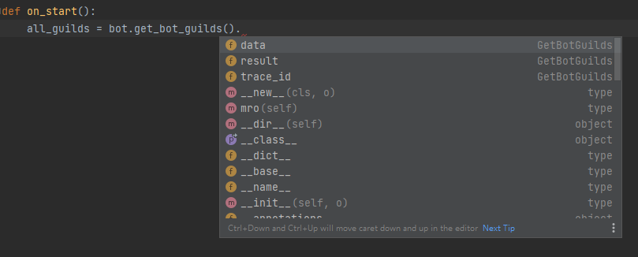

另外，大家也可以使用python的魔法函数 `__doc__` 直接获取实际的字段数据，此魔法函数返回的会是一个json格式的string文本，如下：

```python
print(bot.api.get_bot_info().__doc__)

# .__doc__的返回：
# '{"data": {"id": "xxx", "username": "xxx", "avatar": "xxx"}, "trace_id": "xxx", "result": true}'

# sdk版本 ≥ v2.2.6 可直接print得到相同结果，无需__doc__：
print(bot.api.get_bot_info())
```

同时，v2.2.0或以上版本的sdk也提供了异步版的sdk和api调用，以下是使用异步版api和sdk的一个简单实例：

```python
from qg_botsdk.qg_bot import BOT

async def deliver(data: Model.MESSAGE):
    if '你好' in data.treated_msg:
        await bot.api.send_msg(data.channel_id, '你好，世界', message_id=data.id)

bot = BOT(bot_id='xxx', bot_token='xxx', is_async=True)
bot.bind_msg(deliver)
bot.start()
```

> （更多相关例子可参阅<https://github.com/GLGDLY/qg_botsdk/tree/master/example/example_11(%E4%BD%BF%E7%94%A8%E5%BC%82%E6%AD%A5api).py>）

## 用户（机器人）API

### 获取用户ID（SDK版本>=2.3.2后已遗弃，改为BOT.robot.id）

* 用于获取当前用户（机器人）在频道场景的ID

```python
bot.api.get_bot_id()
# v2.2.0前路径：qg_botsdk.qg_bot.BOT().get_bot_id()
# v2.2.0后路径：qg_botsdk.qg_bot.BOT().api.get_bot_id()
```

> 无可用参数

| 返回     |               |                      |
| ------ | ------------- | -------------------- |
| 字段     | 类型            | 说明                   |
| data   | string 或 None | 返回机器人用户ID，如未注册则为None |
| result | bool          | 成功为True；否则为False     |

### 获取用户信息

* 用于获取当前用户（机器人）详情

```python
bot.api.get_bot_info()
# v2.2.0前路径：qg_botsdk.qg_bot.BOT().get_bot_info()
# v2.2.0后路径：qg_botsdk.qg_bot.BOT().api.get_bot_info()
```

> 无可用参数

| 返回       |        |                  |
| -------- | ------ | ---------------- |
| 字段       | 类型     | 说明               |
| data     | object | 解析后的json数据       |
| trace_id | string | 腾讯官方提供的错误追踪 ID   |
| result   | bool   | 成功为True；否则为False |

### 获取用户频道列表

* 用于获取当前用户（机器人）所加入的所有频道列表

* 已解决分页获取问题，将直接获取全部数据

```python
bot.api.get_bot_guilds()
# v2.2.0前路径：qg_botsdk.qg_bot.BOT().get_bot_guilds()
# v2.2.0后路径：qg_botsdk.qg_bot.BOT().api.get_bot_guilds()
```

> 无可用参数

| 返回       |              |                             |
| -------- | ------------ | --------------------------- |
| 字段       | 类型           | 说明                          |
| data     | list[object] | 返回包含所有数据的列表，其每个项均为object    |
| trace_id | list[string] | 腾讯官方提供的错误追踪 ID ，每次请求整合的列表   |
| result   | list[bool]   | 成功为True；否则为False ，每次请求整合的列表 |

## 频道API

### 获取频道详情

* 用于获取 `guild_id` 指定的频道的详情

```python
bot.api.get_guild_info()
# v2.2.0前路径：qg_botsdk.qg_bot.BOT().get_guild_info()
# v2.2.0后路径：qg_botsdk.qg_bot.BOT().api.get_guild_info()
```

| 参数       |        |        |      |
| -------- | ------ | ------ | ---- |
| 字段名      | 类型     | 默认值    | 说明   |
| guild_id | string | 无，必选参数 | 频道ID |

| 返回       |        |                  |
| -------- | ------ | ---------------- |
| 字段       | 类型     | 说明               |
| data     | object | 解析后的json数据       |
| trace_id | string | 腾讯官方提供的错误追踪 ID   |
| result   | bool   | 成功为True；否则为False |

## 子频道API

| ChannelType |        |
|-------------|--------|
| 0           | 文字子频道  |
| 1           | 保留，不可用 |
| 2           | 语音子频道  |
| 3           | 保留，不可用 |
| 4           | 子频道分组  |
| 10005       | 直播子频道  |
| 10006       | 应用子频道  |
| 10007       | 论坛子频道  |

| ChannelSubType |    |
|----------------|----|
| 0              | 闲聊 |
| 1              | 公告 |
| 2              | 攻略 |
| 3              | 开黑 |

| 应用子频道的应用类型(application_id)            |             |
|---------------------------------------|-------------|
| 1000000                               | 王者开黑大厅      |
| 1000001                               | 互动小游戏       |
| 1000010                               | 腾讯投票        |
| 1000051                               | 飞车开黑大厅      |
| 1000050                               | 日程提醒        |
| 1000070                               | CoDM 开黑大厅   |
| 1010000                               | 和平精英开黑大厅    |


### 获取子频道列表

* 用于获取 `guild_id`指定的频道下的子频道列表

```python
bot.api.get_guild_channels()
# v2.2.0前路径：qg_botsdk.qg_bot.BOT().get_guild_channels()
# v2.2.0后路径：qg_botsdk.qg_bot.BOT().api.get_guild_channels()
```

| 参数       |        |        |      |
| -------- | ------ | ------ | ---- |
| 字段名      | 类型     | 默认值    | 说明   |
| guild_id | string | 无，必选参数 | 频道ID |

| 返回       |              |                          |
| -------- | ------------ | ------------------------ |
| 字段       | 类型           | 说明                       |
| data     | list[object] | 返回包含所有数据的列表，其每个项均为object |
| trace_id | string       | 腾讯官方提供的错误追踪 ID           |
| result   | bool         | 成功为True；否则为False         |

### 获取子频道详情

* 用于获取 `channel_id` 指定的子频道的详情（SDK已自动处理分页问题）

```python
bot.api.get_channels_info()
# v2.2.0前路径：qg_botsdk.qg_bot.BOT().get_channels_info()
# v2.2.0后路径：qg_botsdk.qg_bot.BOT().api.get_channels_info()
```

| 参数         |        |        |       |
| ---------- | ------ | ------ | ----- |
| 字段名        | 类型     | 默认值    | 说明    |
| channel_id | string | 无，必选参数 | 子频道ID |

| 返回       |        |                  |
| -------- | ------ | ---------------- |
| 字段       | 类型     | 说明               |
| data     | object | 解析后的json数据       |
| trace_id | string | 腾讯官方提供的错误追踪 ID   |
| result   | bool   | 成功为True；否则为False |

### 创建子频道

* 用于在 `guild_id` 指定的频道下创建一个子频道

* 要求操作人具有`管理频道`的权限，如果是机器人，则需要将机器人设置为管理员

* 创建成功后，返回创建成功的子频道对象，同时会触发一个频道创建的事件通知

* e.g. <https://github.com/GLGDLY/qg_botsdk/tree/master/example/example_6(%E5%88%9B%E5%BB%BA%E5%AD%90%E9%A2%91%E9%81%93).py>

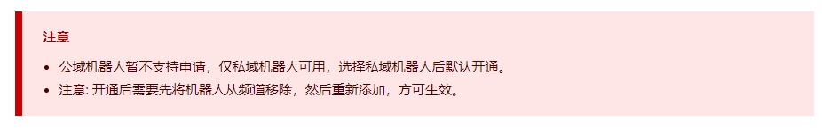

```python
bot.api.create_channels()
# v2.2.0前路径：qg_botsdk.qg_bot.BOT().create_channels()
# v2.2.0后路径：qg_botsdk.qg_bot.BOT().api.create_channels()
```

| 参数               |                |         |                                                |
|------------------|----------------|---------|------------------------------------------------|
| 字段名              | 类型             | 默认值     | 说明                                             |
| guild_id         | string         | 无，必选参数  | 频道ID                                           |
| name             | string         | 无，必选参数  | 需要创建的子频道名                                      |
| type\_           | int            | 无，必选参数  | 需要创建的子频道类型                                     |
| position         | int            | 无，必选参数  | 需要创建的子频道位置，当子频道类型为子频道类型ChannelType=4时，必须大于等于 2 |
| parent_id        | str            | 无，必选参数  | 需要创建的子频道所属分组ID                                 |
| sub_type         | int            | 无，必选参数  | 需要创建的子频道子类型                                    |
| private_type     | int            | 无，必选参数  | 需要创建的子频道私密类型                                   |
| private_user_ids | list[str]      | 无，必选参数  | 需要创建的子频道私密类型成员ID列表                             |
| speak_permission | int            | 无，必选参数  | 需要创建的子频道发言权限                                   |
| application_id   | string or None | None    | 需要创建的应用类型子频道应用 AppID，仅应用子频道需要该字段               |

| 返回        |          |                  |
|-----------|----------|------------------|
| 字段        | 类型       | 说明               |
| data      | object   | 解析后的json数据       |
| trace_id  | string   | 腾讯官方提供的错误追踪 ID   |
| result    | bool     | 成功为True；否则为False |

### 修改子频道

* 用于修改 `channel_id` 指定的子频道的信息

* 要求操作人具有`管理子频道`的权限，如果是机器人，则需要将机器人设置为管理员

* 修改成功后，会触发**子频道更新事件**


```python
bot.api.patch_channels()
# v2.2.0前路径：qg_botsdk.qg_bot.BOT().patch_channels()
# v2.2.0后路径：qg_botsdk.qg_bot.BOT().api.patch_channels()
```

| 参数               |        |        |                                                |
| ---------------- | ------ | ------ | ---------------------------------------------- |
| 字段名              | 类型     | 默认值    | 说明                                             |
| channel_id       | string | 无，必选参数 | 子频道ID                                          |
| name             | string | None   | 需要创建的子频道名                                      |
| position         | int    | 无，必选参数 | 需要创建的子频道位置，当子频道类型为子频道类型ChannelType=4时，必须大于等于 2 |
| parent_id        | str    | 无，必选参数 | 需要创建的子频道所属分组ID                                 |
| private_type     | int    | 无，必选参数 | 需要创建的子频道私密类型                                   |
| speak_permission | int    | 无，必选参数 | 需要创建的子频道发言权限                                   |

| 返回       |        |                  |
| -------- | ------ | ---------------- |
| 字段       | 类型     | 说明               |
| data     | object | 解析后的json数据       |
| trace_id | string | 腾讯官方提供的错误追踪 ID   |
| result   | bool   | 成功为True；否则为False |

### 删除子频道

* 用于删除 `channel_id` 指定的子频道

* 要求操作人具有`管理子频道`的权限，如果是机器人，则需要将机器人设置为管理员

* 修改成功后，会触发**子频道删除事件**

* **子频道的删除是无法撤回的，一旦删除，将无法恢复**


```python
bot.api.delete_channels()
# v2.2.0前路径：qg_botsdk.qg_bot.BOT().delete_channels()
# v2.2.0后路径：qg_botsdk.qg_bot.BOT().api.delete_channels()
```

| 参数         |        |        |       |
| ---------- | ------ | ------ | ----- |
| 字段名        | 类型     | 默认值    | 说明    |
| channel_id | string | 无，必选参数 | 子频道ID |

| 返回       |             |                             |
| -------- | ----------- | --------------------------- |
| 字段       | 类型          | 说明                          |
| data     | object None | 成功时data为None，失败并有code时是错误数据 |
| trace_id | string      | 腾讯官方提供的错误追踪 ID              |
| result   | bool        | 成功为True；否则为False            |

> 可通过 `result` 判断是否成功

## 成员API

### 获取频道成员列表

* 用于获取 `guild_id` 指定的频道中所有成员的详情列表

* 已解决分页获取问题，将直接获取全部数据

```python
bot.api.get_guild_members()
# v2.2.0前路径：qg_botsdk.qg_bot.BOT().get_guild_members()
# v2.2.0后路径：qg_botsdk.qg_bot.BOT().api.get_guild_members()
```

| 参数       |        |        |      |
| -------- | ------ | ------ | ---- |
| 字段名      | 类型     | 默认值    | 说明   |
| guild_id | string | 无，必选参数 | 频道ID |

| 返回       |              |                             |
| -------- | ------------ | --------------------------- |
| 字段       | 类型           | 说明                          |
| data     | list[object] | 返回包含所有数据的列表，其每个项均为object    |
| trace_id | list[string] | 腾讯官方提供的错误追踪 ID ，每次请求整合的列表   |
| result   | list[bool]   | 成功为True；否则为False ，每次请求整合的列表 |

### 获取频道身份组成员列表（需求SDK版本>=v2.4.4）

* 用于获取 `guild_id` 频道中指定 `role_id` 身份组下所有成员的详情列表

* 已解决分页获取问题，将直接获取全部数据


```python
bot.api.get_role_members()
# v2.2.0前路径：qg_botsdk.qg_bot.BOT().get_role_members()
# v2.2.0后路径：qg_botsdk.qg_bot.BOT().api.get_role_members()
```

| 参数       |        |        |       |
| -------- | ------ | ------ | ----- |
| 字段名      | 类型     | 默认值    | 说明    |
| guild_id | string | 无，必选参数 | 频道ID  |
| role_id  | string | 无，必选参数 | 身份组ID |

| 返回       |              |                             |
| -------- | ------------ | --------------------------- |
| 字段       | 类型           | 说明                          |
| data     | list[object] | 返回包含所有数据的列表，其每个项均为object    |
| trace_id | list[string] | 腾讯官方提供的错误追踪 ID ，每次请求整合的列表   |
| result   | list[bool]   | 成功为True；否则为False ，每次请求整合的列表 |

### 获取频道成员详情

* 用于获取 `guild_id` 指定的频道中 `user_id` 对应成员的详细信息

```python
bot.api.get_member_info()
# v2.2.0前路径：qg_botsdk.qg_bot.BOT().get_member_info()
# v2.2.0后路径：qg_botsdk.qg_bot.BOT().api.get_member_info()
```

| 参数       |        |        |      |
| -------- | ------ | ------ | ---- |
| 字段名      | 类型     | 默认值    | 说明   |
| guild_id | string | 无，必选参数 | 频道ID |
| user_id  | string | 无，必选参数 | 用户ID |

| 返回       |        |                  |
| -------- | ------ | ---------------- |
| 字段       | 类型     | 说明               |
| data     | object | 解析后的json数据       |
| trace_id | string | 腾讯官方提供的错误追踪 ID   |
| result   | bool   | 成功为True；否则为False |

### 删除频道成员

* 用于删除 `guild_id` 指定的频道下的成员 `user_id`

* 需要使用的 `token` 对应的用户具备踢人权限。如果是机器人，要求被添加为管理员

* 操作成功后，会触发**频道成员删除事件**

* 无法移除身份为管理员的成员


```python
bot.api.delete_member()
# v2.2.0前路径：qg_botsdk.qg_bot.BOT().delete_member()
# v2.2.0后路径：qg_botsdk.qg_bot.BOT().api.delete_member()
```

| 参数                      |        |        |                          |
| ----------------------- | ------ | ------ | ------------------------ |
| 字段名                     | 类型     | 默认值    | 说明                       |
| guild_id                | string | 无，必选参数 | 频道ID                     |
| user_id                 | string | 无，必选参数 | 用户ID                     |
| add_blacklist           | bool   | False  | 是否同时添加黑名单                |
| delete_history_msg_days | int    | 0      | 用于撤回该成员的消息，可以指定撤回消息的时间范围 |

> 注： `delete_history_msg_day` 消息撤回时间范围仅支持固定的天数：

> `3`  `7`  `15`  `30` ；特殊范围 `-1` （撤回全部消息）； `0` 不撤回任何消息

| 返回       |             |                             |
| -------- | ----------- | --------------------------- |
| 字段       | 类型          | 说明                          |
| data     | object None | 成功时data为None，失败并有code时是错误数据 |
| trace_id | string      | 腾讯官方提供的错误追踪 ID              |
| result   | bool        | 成功为True；否则为False            |

> 可通过 `result` 判断是否成功

## 身份组API

### 获取频道身份组列表

* 用于获取 `guild_id`指定的频道下的身份组列表

```python
bot.api.get_guild_roles()
# v2.2.0前路径：qg_botsdk.qg_bot.BOT().get_guild_roles()
# v2.2.0后路径：qg_botsdk.qg_bot.BOT().api.get_guild_roles()
```

| 参数       |        |        |      |
| -------- | ------ | ------ | ---- |
| 字段名      | 类型     | 默认值    | 说明   |
| guild_id | string | 无，必选参数 | 频道ID |

| 返回       |        |                  |
| -------- | ------ | ---------------- |
| 字段       | 类型     | 说明               |
| data     | object | 解析后的json数据       |
| trace_id | string | 腾讯官方提供的错误追踪 ID   |
| result   | bool   | 成功为True；否则为False |

### 创建频道身份组

* 用于在`guild_id` 指定的频道下创建一个身份组

* 需要使用的 `token` 对应的用户具备创建身份组权限。如果是机器人，要求被添加为管理员

* 参数为非必填，但至少需要传其中之一，默认为空或 `0`

```python
bot.api.create_role()
# v2.2.0前路径：qg_botsdk.qg_bot.BOT().create_role()
# v2.2.0后路径：qg_botsdk.qg_bot.BOT().api.create_role()
```

| 参数       |             |        |                                        |
| -------- | ----------- | ------ | -------------------------------------- |
| 字段名      | 类型          | 默认值    | 说明                                     |
| guild_id | string      | 无，必选参数 | 频道ID                                   |
| name     | string None | None   | 身份组名（选填)                               |
| color    | string None | None   | 身份组颜色，支持输入RGB的三位tuple或HEX的string颜色（选填) |
| hoist    | string None | None   | 是否在成员列表中单独展示（选填）                       |

| 返回       |        |                  |
| -------- | ------ | ---------------- |
| 字段       | 类型     | 说明               |
| data     | object | 解析后的json数据       |
| trace_id | string | 腾讯官方提供的错误追踪 ID   |
| result   | bool   | 成功为True；否则为False |

### 修改频道身份组

* 用于修改频道 `guild_id` 下 `role_id` 指定的身份组

* 需要使用的 `token` 对应的用户具备修改身份组权限。如果是机器人，要求被添加为管理员

* 接口会修改传入的字段，不传入的默认不会修改，至少要传入一个参数

```python
bot.api.patch_role()
# v2.2.0前路径：qg_botsdk.qg_bot.BOT().patch_role()
# v2.2.0后路径：qg_botsdk.qg_bot.BOT().api.patch_role()
```

| 参数       |             |        |                                        |
| -------- | ----------- | ------ | -------------------------------------- |
| 字段名      | 类型          | 默认值    | 说明                                     |
| guild_id | string      | 无，必选参数 | 频道ID                                   |
| role_id  | string      | 无，必选参数 | 需要修改的身份组ID                             |
| name     | string None | None   | 身份组名（选填)                               |
| color    | string None | None   | 身份组颜色，支持输入RGB的三位tuple或HEX的string颜色（选填) |
| hoist    | string None | None   | 是否在成员列表中单独展示（选填）                       |

| 返回       |        |                  |
| -------- | ------ | ---------------- |
| 字段       | 类型     | 说明               |
| data     | object | 解析后的json数据       |
| trace_id | string | 腾讯官方提供的错误追踪 ID   |
| result   | bool   | 成功为True；否则为False |

### 删除频道身份组

* 用于删除频道`guild_id`下 `role_id` 对应的身份组

* 需要使用的 `token` 对应的用户具备删除身份组权限。如果是机器人，要求被添加为管理员

```python
bot.api.delete_role()
# v2.2.0前路径：qg_botsdk.qg_bot.BOT().delete_role()
# v2.2.0后路径：qg_botsdk.qg_bot.BOT().api.delete_role()
```

| 参数       |        |        |            |
| -------- | ------ | ------ | ---------- |
| 字段名      | 类型     | 默认值    | 说明         |
| guild_id | string | 无，必选参数 | 频道ID       |
| role_id  | string | 无，必选参数 | 需要修改的身份组ID |

| 返回       |             |                             |
| -------- | ----------- | --------------------------- |
| 字段       | 类型          | 说明                          |
| data     | object None | 成功时data为None，失败并有code时是错误数据 |
| trace_id | string      | 腾讯官方提供的错误追踪 ID              |
| result   | bool        | 成功为True；否则为False            |

> 可通过 `result` 判断是否成功

### 创建频道身份组成员

* 用于将频道`guild_id`下的用户 `user_id` 添加到身份组 `role_id`

* 需要使用的 `token` 对应的用户具备增加身份组成员权限。如果是机器人，要求被添加为管理员

* 如果要增加的身份组 `ID` 是`5-子频道管理员`，需要增加 `channel_id` 参数来指定具体是哪个子频道

```python
bot.api.create_role_member()
# v2.2.0前路径：qg_botsdk.qg_bot.BOT().create_role_member()
# v2.2.0后路径：qg_botsdk.qg_bot.BOT().api.create_role_member()
```

| 参数         |             |        |                            |
| ---------- | ----------- | ------ | -------------------------- |
| 字段名        | 类型          | 默认值    | 说明                         |
| user_id    | string      | 无，必选参数 | 目标成员的用户ID                  |
| guild_id   | string      | 无，必选参数 | 频道ID                       |
| role_id    | string      | 无，必选参数 | 身份组ID                      |
| channel_id | string None | None   | 子频道ID（选填）[当role_id = 5时必填] |

| 返回       |             |                             |
| -------- | ----------- | --------------------------- |
| 字段       | 类型          | 说明                          |
| data     | object None | 成功时data为None，失败并有code时是错误数据 |
| trace_id | string      | 腾讯官方提供的错误追踪 ID              |
| result   | bool        | 成功为True；否则为False            |

> 可通过 `result` 判断是否成功

### 删除频道身份组成员

* 用于将 用户 `user_id` 从 频道 `guild_id` 的 `role_id` 身份组中移除

* 需要使用的 `token` 对应的用户具备删除身份组成员权限。如果是机器人，要求被添加为管理员

* 如果要删除的身份组 `ID` 是`5-子频道管理员`，需要增加 `channel_id` 参数来指定具体是哪个子频道

```python
bot.api.delete_role_member()
# v2.2.0前路径：qg_botsdk.qg_bot.BOT().delete_role_member()
# v2.2.0后路径：qg_botsdk.qg_bot.BOT().api.delete_role_member()
```

| 参数         |             |        |                            |
| ---------- | ----------- | ------ | -------------------------- |
| 字段名        | 类型          | 默认值    | 说明                         |
| user_id    | string      | 无，必选参数 | 目标成员的用户ID                  |
| guild_id   | string      | 无，必选参数 | 频道ID                       |
| role_id    | string      | 无，必选参数 | 身份组ID                      |
| channel_id | string None | None   | 子频道ID（选填）[当role_id = 5时必填] |

| 返回       |             |                             |
| -------- | ----------- | --------------------------- |
| 字段       | 类型          | 说明                          |
| data     | object None | 成功时data为None，失败并有code时是错误数据 |
| trace_id | string      | 腾讯官方提供的错误追踪 ID              |
| result   | bool        | 成功为True；否则为False            |

> 可通过 `result` 判断是否成功

## 子频道权限API

* 子频道权限详情：
  + 把以下数值按需要进行位运算后（如1|4）后，得到的值转变为string填入permissions字段即可

| 子频道权限permissions字段数据 |        |                                         |
| -------------------- | ------ | --------------------------------------- |
| 值                    | 类型     | 说明                                      |
| 1(1<<0)               | string | 可查看子频道：支持指定成员可见类型，支持身份组可见类型             |
| 2(1<<1)               | string | 可管理子频道：创建者、管理员、子频道管理员都具有此权限             |
| 4(1<<2)               | string | 可发言子频道：支持指定成员发言类型，支持身份组发言类型             |
| 8(1<<3)               | string | 可直播子频道：支持指定成员发起直播，支持身份组发起直播；仅可在直播子频道中设置 |

### 获取子频道用户权限

* 用于获取 子频道`channel_id` 下用户 `user_id` 的权限

* 获取子频道用户权限

* 要求操作人具有管理子频道的权限（需要将机器人设置为管理员）

```python
bot.api.get_channel_member_permission()
# v2.2.0前路径：qg_botsdk.qg_bot.BOT().get_channel_member_permission()
# v2.2.0后路径：qg_botsdk.qg_bot.BOT().api.get_channel_member_permission()
```

| 参数         |        |        |           |
| ---------- | ------ | ------ | --------- |
| 字段名        | 类型     | 默认值    | 说明        |
| channel_id | string | 无，必选参数 | 子频道ID     |
| user_id    | string | 无，必选参数 | 目标成员的用户ID |

| 返回       |        |                  |
| -------- | ------ | ---------------- |
| 字段       | 类型     | 说明               |
| data     | object | 解析后的json数据       |
| trace_id | string | 腾讯官方提供的错误追踪 ID   |
| result   | bool   | 成功为True；否则为False |

### 修改子频道用户权限

* 用于修改子频道 `channel_id` 下用户 `user_id` 的权限

* 要求操作人具有`管理子频道`的权限（需要将机器人设置为管理员）

* 参数包括`add`和`remove`两个字段，分别表示授予的权限以及删除的权限。要授予用户权限即把`add`对应位置 1，删除用户权限即把`remove`对应位置 1。当两个字段同一位都为 1，表现为删除权限

* 本接口不支持修改`可管理子频道`权限

```python
bot.api.put_channel_member_permission()
# v2.2.0前路径：qg_botsdk.qg_bot.BOT().put_channel_member_permission()
# v2.2.0后路径：qg_botsdk.qg_bot.BOT().api.put_channel_member_permission()
```

| 参数         |             |        |                  |
| ---------- | ----------- | ------ | ---------------- |
| 字段名        | 类型          | 默认值    | 说明               |
| channel_id | string      | 无，必选参数 | 子频道ID            |
| user_id    | string      | 无，必选参数 | 目标成员的用户ID        |
| add        | string None | None   | 赋予用户的权限（1，2，4，8按需进行位运算后的结果） |
| remove     | string None | None   | 删除用户的权限（1，2，4，8按需进行位运算后的结果） |

| 返回       |             |                             |
| -------- | ----------- | --------------------------- |
| 字段       | 类型          | 说明                          |
| data     | object None | 成功时data为None，失败并有code时是错误数据 |
| trace_id | string      | 腾讯官方提供的错误追踪 ID              |
| result   | bool        | 成功为True；否则为False            |

> 可通过 `result` 判断是否成功

### 获取子频道身份组权限

* 用于获取子频道 `channel_id` 下身份组 `role_id` 的权限

* 要求操作人具有管理子频道的权限（需要将机器人设置为管理员）

```python
bot.api.get_channel_role_permission()
# v2.2.0前路径：qg_botsdk.qg_bot.BOT().get_channel_role_permission()
# v2.2.0后路径：qg_botsdk.qg_bot.BOT().api.get_channel_role_permission()
```

| 参数         |        |        |         |
| ---------- | ------ | ------ | ------- |
| 字段名        | 类型     | 默认值    | 说明      |
| channel_id | string | 无，必选参数 | 子频道ID   |
| role_id    | string | 无，必选参数 | 目标身份组ID |

| 返回       |        |                  |
| -------- | ------ | ---------------- |
| 字段       | 类型     | 说明               |
| data     | object | 解析后的json数据       |
| trace_id | string | 腾讯官方提供的错误追踪 ID   |
| result   | bool   | 成功为True；否则为False |

### 修改子频道身份组权限

* 用于修改子频道 channel_id 下身份组 role_id 的权限

* 要求操作人具有`管理子频道`的权限（需要将机器人设置为管理员）

* 参数包括`add`和`remove`两个字段，分别表示授予的权限以及删除的权限。要授予身份组权限即把`add`对应位置 1，删除身份组权限即把`remove`对应位置 1。当两个字段同一位都为 1，表现为删除权限。

* 本接口不支持修改`可管理子频道`权限

```python
bot.api.put_channel_role_permission()
# v2.2.0前路径：qg_botsdk.qg_bot.BOT().put_channel_role_permission()
# v2.2.0后路径：qg_botsdk.qg_bot.BOT().api.put_channel_role_permission()
```

| 参数         |             |        |                  |
| ---------- | ----------- | ------ | ---------------- |
| 字段名        | 类型          | 默认值    | 说明               |
| channel_id | string      | 无，必选参数 | 子频道ID            |
| role_id    | string      | 无，必选参数 | 目标身份组ID          |
| add        | string None | None   | 赋予用户的权限（1，2，4，8按需进行位运算后的结果） |
| remove     | string None | None   | 删除用户的权限（1，2，4，8按需进行位运算后的结果） |

| 返回       |             |                             |
| -------- | ----------- | --------------------------- |
| 字段       | 类型          | 说明                          |
| data     | object None | 成功时data为None，失败并有code时是错误数据 |
| trace_id | string      | 腾讯官方提供的错误追踪 ID              |
| result   | bool        | 成功为True；否则为False            |

> 可通过 `result` 判断是否成功

## 消息API

* 主动消息：发送消息时，未填充 `msg_id/event_id` 字段的消息。

* 被动消息：发送消息时，填充了 `msg_id/event_id` 字段的消息。`msg_id` 和 `event_id` 两个字段任意填一个即为被动消息。接口使用此 `msg_id/event_id` 拉取用户的消息或事件，同时判断用户消息或事件的发送时间，如果超过被动消息回复时效，将会不允许发送该消息。

* 目前支持被动回复的事件类型有: GUILD_MEMBER_ADD GUILD_MEMBER_UPDATE GUILD_MEMBER_REMOVE MESSAGE_REACTION_ADD MESSAGE_REACTION_REMOVE FORUM_THREAD_CREATE FORUM_THREAD_UPDATE FORUM_THREAD_DELETE FORUM_POST_CREATE FORUM_POST_DELETE FORUM_REPLY_CREATE FORUM_REPLY_DELETE

### 获取指定消息

* 用于获取子频道 `channel_id` 下的消息 `message_id` 的详情

```python
bot.api.get_message_info()
# v2.2.0前路径：qg_botsdk.qg_bot.BOT().get_message_info()
# v2.2.0后路径：qg_botsdk.qg_bot.BOT().api.get_message_info()
```

| 参数         |        |        |        |
| ---------- | ------ | ------ | ------ |
| 字段名        | 类型     | 默认值    | 说明     |
| channel_id | string | 无，必选参数 | 子频道ID  |
| message_id | string | 无，必选参数 | 目标消息ID |

| 返回       |        |                  |
| -------- | ------ | ---------------- |
| 字段       | 类型     | 说明               |
| data     | object | 解析后的json数据       |
| trace_id | string | 腾讯官方提供的错误追踪 ID   |
| result   | bool   | 成功为True；否则为False |

### 发送普通消息

* 用于向 `channel_id` 指定的子频道发送消息

* 要求操作人在该子频道具有`发送消息`的权限

* 主动消息在频道主或管理设置了情况下，按设置的数量进行限频。在未设置的情况遵循如下限制:

  + 主动推送消息，默认每天往每个子频道可推送的消息数是 `20` 条，超过会被限制

  + 主动推送消息在每个频道中，每天可以往 `2` 个子频道推送消息。超过后会被限制

* 不论主动消息还是被动消息，在一个子频道中，每 `1s` 只能发送 `5` 条消息

* 被动回复消息有效期为 `5` 分钟。超时会报错

* 有关主动消息审核，可以通过sdk中绑定审核事件{any}`bind_audit() <绑定审核事件>`，从审核事件 MESSAGE_AUDIT 返回数据获取结果

```python
bot.api.send_msg()
# v2.2.0前路径：qg_botsdk.qg_bot.BOT().send_msg()
# v2.2.0后路径：qg_botsdk.qg_bot.BOT().api.send_msg()
```

| 参数                             |                                   |        |                                                                                                  |
| ------------------------------ | --------------------------------- | ------ | ------------------------------------------------------------------------------------------------ |
| 字段名                            | 类型                                | 默认值    | 说明                                                                                               |
| channel_id                     | string                            | 无，必选参数 | 子频道ID                                                                                            |
| content                        | string None                       | None   | 消息内容文本（选填）                                                                                       |
| image                          | string None                       | None   | 图片url，不可发送本地图片（选填）                                                                               |
| file_image                     | bytesBinaryIOstrPathLike[str]None | None   | 本地图片，可选以下三种方式传参：阅读档案后传入bytes类型图片数据、打开档案后直接传入档案、直接传入图片路径（具体例子可参阅github example_10，要求SDK版本>=2.1.3） |
| message_id                     | string None                       | None   | 消息id（选填，如此项数据项与event_id均为None，则为此消息主动消息）                                                         |
| event_id                       | string None                       | None   | 事件id（选填，如此项数据项与message_id均为None，则为此消息主动消息）                                                       |
| message_reference_id           | string None                       | None   | 引用消息的id（选填）                                                                                      |
| ignore_message_reference_error | bool None                         | None   | 是否忽略获取引用消息详情错误，默认否（选填）                                                                           |

> * `content`  `image` 至少需要有一个字段，否则无法下发消息

> * `file_image` 参数可传递本地图片，具体例子可参阅 [example_10](https://github.com/GLGDLY/qg_botsdk/tree/master/example/example_10(%E5%8F%91%E9%80%81%E6%9C%AC%E5%9C%B0%E5%9B%BE%E7%89%87).py)（要求SDK版本>=2.1.3，当前仅普通消息可直接上传图片，embed和ark暂无相关能力）

| 返回       |        |                  |
| -------- | ------ | ---------------- |
| 字段       | 类型     | 说明               |
| data     | object | 解析后的json数据       |
| trace_id | string | 腾讯官方提供的错误追踪 ID   |
| result   | bool   | 成功为True；否则为False |

### 发送embed模板消息

* 发送embed模板消息的API

* 发送限制与普通消息相同

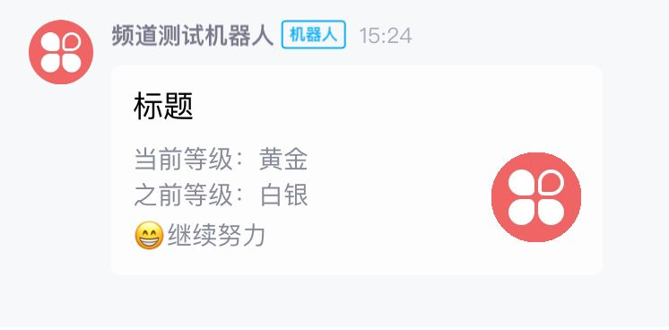

```python
bot.api.send_embed()
# v2.2.0前路径：qg_botsdk.qg_bot.BOT().send_embed()
# v2.2.0后路径：qg_botsdk.qg_bot.BOT().api.send_embed()
```

| 参数         |             |        |                                            |
| ---------- | ----------- | ------ | ------------------------------------------ |
| 字段名        | 类型          | 默认值    | 说明                                         |
| channel_id | string      | 无，必选参数 | 子频道ID                                      |
| title      | string None | None   | 消息标题（选填）                                   |
| content    | list None   | None   | 内容文本列表，每一项之间将存在分行（选填）                      |
| image      | string None | None   | 略缩图url，不可发送本地图片（选填）                        |
| prompt     | string None | None   | 消息弹窗通知的文本内容（选填）                            |
| message_id | string None | None   | 消息id（选填，如此项数据项与event_id均为None，则为此消息主动消息）   |
| event_id   | string None | None   | 事件id（选填，如此项数据项与message_id均为None，则为此消息主动消息） |

> `title`  `content` 至少需要有一个字段，否则无法下发消息

| 返回       |        |                  |
| -------- | ------ | ---------------- |
| 字段       | 类型     | 说明               |
| data     | object | 解析后的json数据       |
| trace_id | string | 腾讯官方提供的错误追踪 ID   |
| result   | bool   | 成功为True；否则为False |

### 发送 23 链接+文本列表模板ark消息

* 发送ark（id=23）模板消息的API，请注意机器人是否有权限使用此API

* 发送限制与普通消息相同

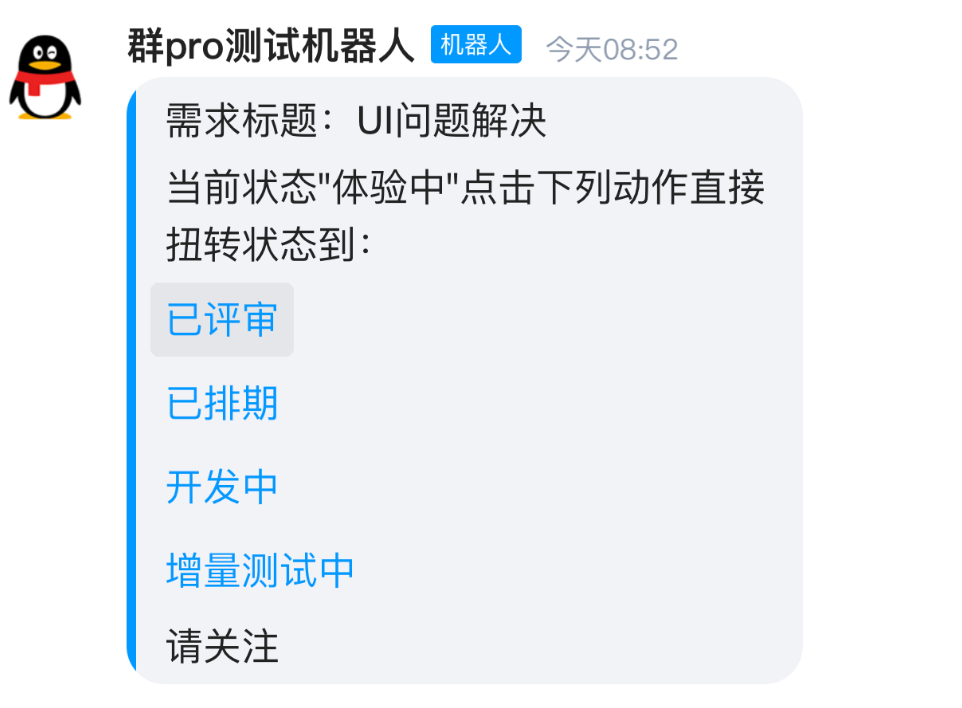

```python
bot.api.send_ark_23()
# v2.2.0前路径：qg_botsdk.qg_bot.BOT().send_ark_23()
# v2.2.0后路径：qg_botsdk.qg_bot.BOT().api.send_ark_23()
```

| 参数         |             |        |                                                            |
| ---------- | ----------- | ------ | ---------------------------------------------------------- |
| 字段名        | 类型          | 默认值    | 说明                                                         |
| channel_id | string      | 无，必选参数 | 子频道ID                                                      |
| content    | list None   | 无，必选参数 | 内容文本列表，每一项之间将存在分行                                          |
| link       | list None   | 无，必选参数 | 链接url列表，长度应与内容列一致。将根据位置顺序填充文本超链接，如文本不希望填充链接可使用空文本或None填充位置 |
| desc       | string None | None   | 描述文本内容（选填）                                                 |
| prompt     | string None | None   | 消息弹窗通知的文本内容（选填）                                            |
| message_id | string None | None   | 消息id（选填，如此项数据项与event_id均为None，则为此消息主动消息）                   |
| event_id   | string None | None   | 事件id（选填，如此项数据项与message_id均为None，则为此消息主动消息）                 |

> 如 `content` 为["文本1", "文本2"]，而不希望填充任何链接， `link` 可填入["", ""]

| 返回       |        |                  |
| -------- | ------ | ---------------- |
| 字段       | 类型     | 说明               |
| data     | object | 解析后的json数据       |
| trace_id | string | 腾讯官方提供的错误追踪 ID   |
| result   | bool   | 成功为True；否则为False |

### 发送 24 文本+缩略图模板ark消息

* 发送ark（id=24）模板消息的API，请注意机器人是否有权限使用此API

* 发送限制与普通消息相同

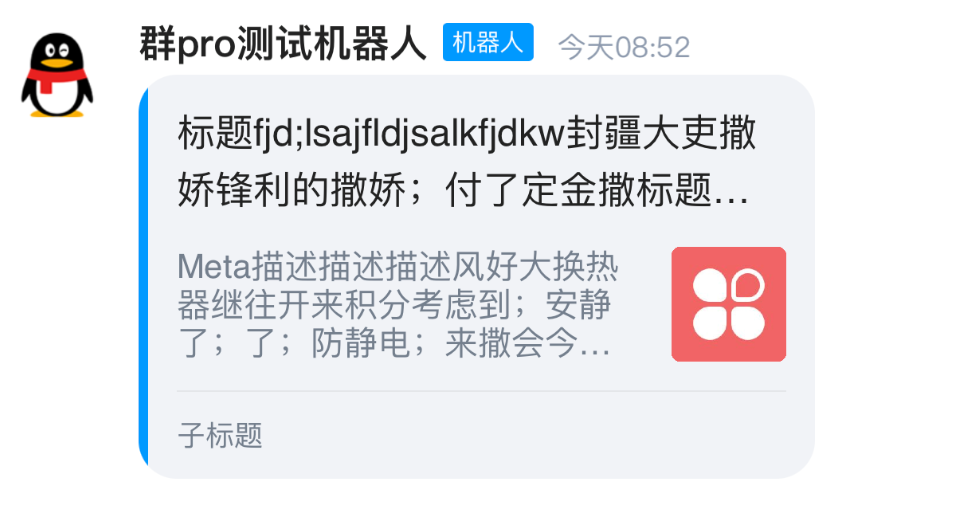

```python
bot.api.send_ark_24()
# v2.2.0前路径：qg_botsdk.qg_bot.BOT().send_ark_24()
# v2.2.0后路径：qg_botsdk.qg_bot.BOT().api.send_ark_24()
```

| 参数         |             |        |                                            |
| ---------- | ----------- | ------ | ------------------------------------------ |
| 字段名        | 类型          | 默认值    | 说明                                         |
| channel_id | string      | 无，必选参数 | 子频道ID                                      |
| title      | string None | None   | 消息标题（选填）                                   |
| content    | string None | None   | 消息内容文本（选填）                                 |
| subtitile  | string None | None   | 消息标题（选填）                                   |
| link       | string None | None   | 跳转的链接url（选填）                               |
| image      | string None | None   | 略缩图url，不可发送本地图片（选填）                        |
| desc       | string None | None   | 描述文本内容（选填）                                 |
| prompt     | string None | None   | 消息弹窗通知的文本内容（选填）                            |
| message_id | string None | None   | 消息id（选填，如此项数据项与event_id均为None，则为此消息主动消息）   |
| event_id   | string None | None   | 事件id（选填，如此项数据项与message_id均为None，则为此消息主动消息） |

> `title`  `content`  `subtitile` 至少需要有一个字段，否则无法下发消息

| 返回       |        |                  |
| -------- | ------ | ---------------- |
| 字段       | 类型     | 说明               |
| data     | object | 解析后的json数据       |
| trace_id | string | 腾讯官方提供的错误追踪 ID   |
| result   | bool   | 成功为True；否则为False |

### 发送 37 大图模板ark消息

* 发送ark（id=37）模板消息的API，请注意机器人是否有权限使用此API

* 发送限制与普通消息相同

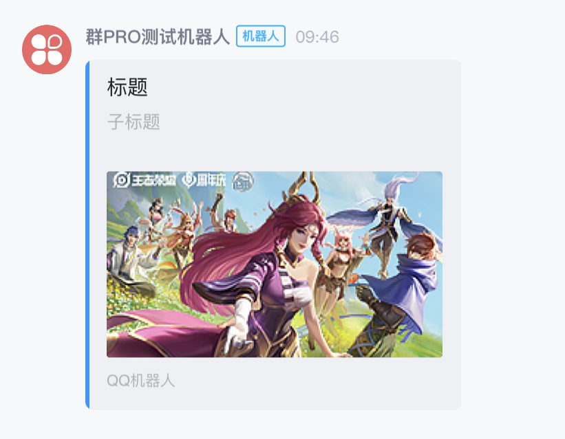

```python
bot.api.send_ark_37()
# v2.2.0前路径：qg_botsdk.qg_bot.BOT().send_ark_37()
# v2.2.0后路径：qg_botsdk.qg_bot.BOT().api.send_ark_37()
```

| 参数         |             |        |                                            |
| ---------- | ----------- | ------ | ------------------------------------------ |
| 字段名        | 类型          | 默认值    | 说明                                         |
| channel_id | string      | 无，必选参数 | 子频道ID                                      |
| title      | string None | None   | 消息标题（选填）                                   |
| content    | string None | None   | 消息内容文本（选填）                                 |
| link       | string None | None   | 跳转的链接url（选填）                               |
| image      | string None | None   | 略缩图url，不可发送本地图片（选填）                        |
| prompt     | string None | None   | 消息弹窗通知的文本内容（选填）                            |
| message_id | string None | None   | 消息id（选填，如此项数据项与event_id均为None，则为此消息主动消息）   |
| event_id   | string None | None   | 事件id（选填，如此项数据项与message_id均为None，则为此消息主动消息） |

> `title`  `content` 至少需要有一个字段，否则无法下发消息

| 返回       |        |                  |
| -------- | ------ | ---------------- |
| 字段       | 类型     | 说明               |
| data     | object | 解析后的json数据       |
| trace_id | string | 腾讯官方提供的错误追踪 ID   |
| result   | bool   | 成功为True；否则为False |

### 发送 markdown 消息 （需求SDK版本>=2.3.6）

* 发送markdown消息的API，请注意机器人是否有权限使用此API

* 发送限制与普通消息相同

* markdown格式说明请参阅[此处](https://bot.q.qq.com/wiki/develop/api/openapi/message/format/markdown/markdown.html)

* 具体例子请参考[此处](https://github.com/GLGDLY/qg_botsdk/tree/master/example/example_12(markdown).py)

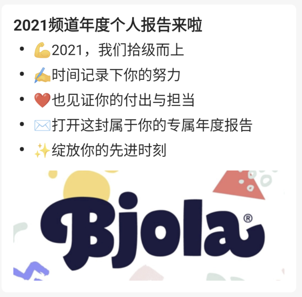

```python
bot.api.send_markdown()
# v2.2.0前路径：qg_botsdk.qg_bot.BOT().send_markdown()
# v2.2.0后路径：qg_botsdk.qg_bot.BOT().api.send_markdown()
```

| 参数               |                                  |        |                                                                                  |
| ---------------- | -------------------------------- | ------ | -------------------------------------------------------------------------------- |
| 字段名              | 类型                               | 默认值    | 说明                                                                               |
| channel_id       | string                           | 无，必选参数 | 子频道ID                                                                            |
| template_id      | string None                      | None   | markdown 模板 id（选填，与content不可同时存在）                                                |
| key_values       | list\[{str: str/list[str]}] None | None   | markdown 模版 key values列表，格式为：[{key1: value1}, {key2: value2}]（选填，与content不可同时存在） |
| content          | string None                      | None   | 原生 markdown 内容（选填，与template_id, key, values不可同时存在）                               |
| keyboard_id      | string None                      | None   | keyboard 模板 id（选填，与keyboard_content不可同时存在）                                       |
| keyboard_content | dict None                        | None   | 原生 keyboard 内容（选填，与keyboard_id不可同时存在）                                            |
| message_id       | string None                      | None   | 消息id（选填，如此项数据项与event_id均为None，则为此消息主动消息）                                         |
| event_id         | string None                      | None   | 事件id（选填，如此项数据项与message_id均为None，则为此消息主动消息）                                       |

> `template_id`  `content` 至少需要有一个字段，否则无法下发消息

| 返回       |        |                  |
| -------- | ------ | ---------------- |
| 字段       | 类型     | 说明               |
| data     | object | 解析后的json数据       |
| trace_id | string | 腾讯官方提供的错误追踪 ID   |
| result   | bool   | 成功为True；否则为False |

### 撤回消息

* 用于撤回子频道 `channel_id` 下的消息 `message_id`

* 机器人需为管理员，可撤回普通成员的消息


```python
bot.api.delete_msg()
# v2.2.0前路径：qg_botsdk.qg_bot.BOT().delete_msg()
# v2.2.0后路径：qg_botsdk.qg_bot.BOT().api.delete_msg()
```

| 参数         |        |        |                                |
| ---------- | ------ | ------ | ------------------------------ |
| 字段名        | 类型     | 默认值    | 说明                             |
| channel_id | string | 无，必选参数 | 子频道ID                          |
| message_id | string | 无，必选参数 | 需撤回消息的消息ID                     |
| hidetip    | bool   | False  | 是否隐藏提示小灰条，True为隐藏，False为显示（选填） |

| 返回       |             |                             |
| -------- | ----------- | --------------------------- |
| 字段       | 类型          | 说明                          |
| data     | object None | 成功时data为None，失败并有code时是错误数据 |
| trace_id | string      | 腾讯官方提供的错误追踪 ID              |
| result   | bool        | 成功为True；否则为False            |

> 可通过 `result` 判断是否成功

### 消息文本中的官方内嵌格式

* 内嵌格式仅在普通消息中会生效，在 `Ark` 和 `Embed` 中不生效，而会原样输出

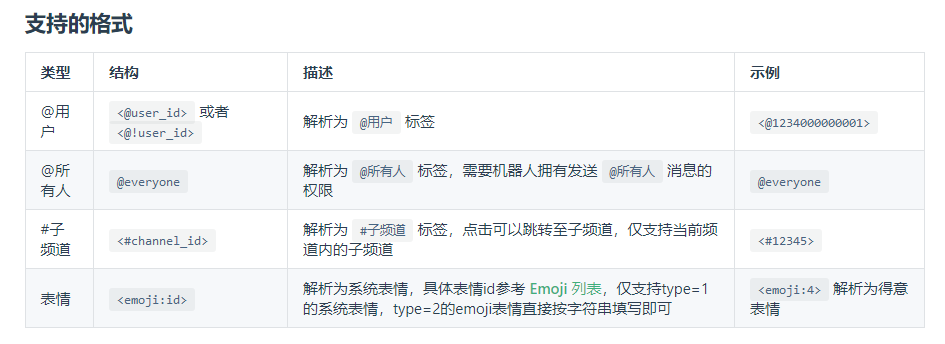

## 消息频率API

### 获取频道消息频率设置

* 用于获取机器人在频道 `guild_id` 内的消息频率设置

```python
bot.api.get_guild_setting()
# v2.2.0前路径：qg_botsdk.qg_bot.BOT().get_guild_setting()
# v2.2.0后路径：qg_botsdk.qg_bot.BOT().api.get_guild_setting()
```

| 参数       |        |        |      |
| -------- | ------ | ------ | ---- |
| 字段名      | 类型     | 默认值    | 说明   |
| guild_id | string | 无，必选参数 | 频道ID |

| 返回       |        |                  |
| -------- | ------ | ---------------- |
| 字段       | 类型     | 说明               |
| data     | object | 解析后的json数据       |
| trace_id | string | 腾讯官方提供的错误追踪 ID   |
| result   | bool   | 成功为True；否则为False |

`data` 字段数据内容简述：

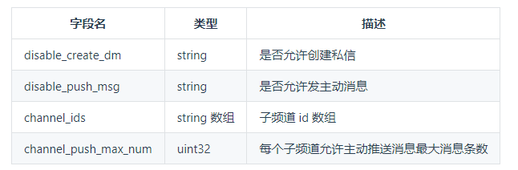

## 私信API

### 创建私信会话

* 用于机器人和在同一个频道内的成员创建私信会话

* 机器人和用户存在共同频道才能创建私信会话

* 创建成功后，返回创建成功的频道id  `guild_id`，子频道id `channel_id`和创建时间，**注意发送私信仅需要使用guild_id这一项虚拟频道id的数据**

```python
bot.api.create_dm_guild()
# v2.2.0前路径：qg_botsdk.qg_bot.BOT().create_dm_guild()
# v2.2.0后路径：qg_botsdk.qg_bot.BOT().api.create_dm_guild()
```

| 参数        |        |        |                 |
| --------- | ------ | ------ | --------------- |
| 字段名       | 类型     | 默认值    | 说明              |
| target_id | string | 无，必选参数 | 目标用户ID          |
| guild_id  | string | 无，必选参数 | 机器人跟目标用户所在的频道ID |

| 返回       |        |                  |
| -------- | ------ | ---------------- |
| 字段       | 类型     | 说明               |
| data     | object | 解析后的json数据       |
| trace_id | string | 腾讯官方提供的错误追踪 ID   |
| result   | bool   | 成功为True；否则为False |

### 发送私信消息

* 用于发送私信消息，前提是已经创建了私信会话。

* 私信的 `guild_id` 在{any}`创建私信会话 <创建私信会话>`时以及{any}`私信消息事件 <绑定接收私信消息事件>`中获取

* 私信场景下，每个机器人每天可以对一个用户发 2 条主动消息

* 私信场景下，每个机器人每天累计可以发 200 条主动消息

* 私信场景下，被动消息没有条数限制

```python
bot.api.send_dm()
# v2.2.0前路径：qg_botsdk.qg_bot.BOT().send_dm()
# v2.2.0后路径：qg_botsdk.qg_bot.BOT().api.send_dm()
```

| 参数                             |                                   |        |                                                                                                  |
| ------------------------------ | --------------------------------- | ------ | ------------------------------------------------------------------------------------------------ |
| 字段名                            | 类型                                | 默认值    | 说明                                                                                               |
| guild_id                       | string                            | 无，必选参数 | 虚拟频道id（非子频道id channel_id）                                                                        |
| content                        | string None                       | None   | 消息内容文本（选填）                                                                                       |
| image                          | string None                       | None   | 图片url，不可发送本地图片（选填）                                                                               |
| file_image                     | bytesBinaryIOstrPathLike[str]None | None   | 本地图片，可选以下三种方式传参：阅读档案后传入bytes类型图片数据、打开档案后直接传入档案、直接传入图片路径（具体例子可参阅github example_10，要求SDK版本>=2.1.5） |
| message_id                     | string None                       | None   | 消息id（选填，如此项数据项与event_id均为None，则为此消息主动消息）                                                         |
| event_id                       | string None                       | None   | 事件id（选填，如此项数据项与message_id均为None，则为此消息主动消息）                                                       |
| message_reference_id           | string None                       | None   | 引用消息的id（选填）                                                                                      |
| ignore_message_reference_error | bool None                         | None   | 是否忽略获取引用消息详情错误，默认否（选填）                                                                           |

> `content`  `image` 至少需要有一个字段，否则无法下发消息

| 返回       |        |                  |
| -------- | ------ | ---------------- |
| 字段       | 类型     | 说明               |
| data     | object | 解析后的json数据       |
| trace_id | string | 腾讯官方提供的错误追踪 ID   |
| result   | bool   | 成功为True；否则为False |

### 撤回私信消息

* 用于撤回私信频道 `guild_id` 中 `message_id` 指定的私信消息。只能用于撤回机器人自己发送的私信


```python
bot.api.delete_dm_msg()
# v2.2.0前路径：qg_botsdk.qg_bot.BOT().delete_dm_msg()
# v2.2.0后路径：qg_botsdk.qg_bot.BOT().api.delete_dm_msg()
```

| 参数         |        |        |                                |
| ---------- | ------ | ------ | ------------------------------ |
| 字段名        | 类型     | 默认值    | 说明                             |
| guild_id   | string | 无，必选参数 | 虚拟频道id（非子频道id channel_id）      |
| message_id | string | 无，必选参数 | 需撤回消息的消息ID                     |
| hidetip    | bool   | False  | 是否隐藏提示小灰条，True为隐藏，False为显示（选填） |

| 返回       |             |                             |
| -------- | ----------- | --------------------------- |
| 字段       | 类型          | 说明                          |
| data     | object None | 成功时data为None，失败并有code时是错误数据 |
| trace_id | string      | 腾讯官方提供的错误追踪 ID              |
| result   | bool        | 成功为True；否则为False            |

> 可通过 `result` 判断是否成功

## 禁言API

### 禁言全员

* 用于将频道的全体成员（非管理员）禁言

* 需要使用的 `token` 对应的用户具备管理员权限（要求被添加为管理员）

* 该接口同样可用于解除禁言，将`mute_end_timestamp`或`mute_seconds`传值为字符串`'0'`即可

```python
bot.api.mute_all_member()
# v2.2.0前路径：qg_botsdk.qg_bot.BOT().mute_all_member()
# v2.2.0后路径：qg_botsdk.qg_bot.BOT().api.mute_all_member()
```

| 参数                 |             |        |                                                   |
| ------------------ | ----------- | ------ | ------------------------------------------------- |
| 字段名                | 类型          | 默认值    | 说明                                                |
| guild_id           | string      | 无，必选参数 | 频道id                                              |
| mute_end_timestamp | string None | None   | 禁言到期时间戳，绝对时间戳，单位：秒（与 mute_seconds字段同时赋值的话，以该字段为准） |
| mute_seconds       | string None | None   | 禁言多少秒（两个字段二选一，默认以 mute_end_timestamp为准）           |

| 返回       |             |                             |
| -------- | ----------- | --------------------------- |
| 字段       | 类型          | 说明                          |
| data     | object None | 成功时data为None，失败并有code时是错误数据 |
| trace_id | string      | 腾讯官方提供的错误追踪 ID              |
| result   | bool        | 成功为True；否则为False            |

> 可通过 `result` 判断是否成功

### 禁言指定成员

* 用于禁言频道 `guild_id` 下的成员 `user_id`

* 需要使用的 `token` 对应的用户具备管理员权限（要求被添加为管理员）

* 该接口同样可用于解除禁言，将`mute_end_timestamp`或`mute_seconds`传值为字符串`'0'`即可

```python
bot.api.mute_member()
# v2.2.0前路径：qg_botsdk.qg_bot.BOT().mute_member()
# v2.2.0后路径：qg_botsdk.qg_bot.BOT().api.mute_member()
```

| 参数                 |             |        |                                                   |
| ------------------ | ----------- | ------ | ------------------------------------------------- |
| 字段名                | 类型          | 默认值    | 说明                                                |
| guild_id           | string      | 无，必选参数 | 频道id                                              |
| user_id            | string      | 无，必选参数 | 目标成员的用户ID                                         |
| mute_end_timestamp | string None | None   | 禁言到期时间戳，绝对时间戳，单位：秒（与 mute_seconds字段同时赋值的话，以该字段为准） |
| mute_seconds       | string None | None   | 禁言多少秒（两个字段二选一，默认以 mute_end_timestamp为准）           |

| 返回       |             |                             |
| -------- | ----------- | --------------------------- |
| 字段       | 类型          | 说明                          |
| data     | object None | 成功时data为None，失败并有code时是错误数据 |
| trace_id | string      | 腾讯官方提供的错误追踪 ID              |
| result   | bool        | 成功为True；否则为False            |

> 可通过 `result` 判断是否成功

### 禁言批量成员

* 用于将频道的指定批量成员（非管理员）禁言

* 需要使用的 `token` 对应的用户具备管理员权限（要求被添加为管理员）

* 该接口同样可用于解除禁言，将`mute_end_timestamp`或`mute_seconds`传值为字符串`'0'`即可

```python
bot.api.mute_members()
# v2.2.0前路径：qg_botsdk.qg_bot.BOT().mute_members()
# v2.2.0后路径：qg_botsdk.qg_bot.BOT().api.mute_members()
```

| 参数                 |             |        |                                                   |
| ------------------ | ----------- | ------ | ------------------------------------------------- |
| 字段名                | 类型          | 默认值    | 说明                                                |
| guild_id           | string      | 无，必选参数 | 频道id                                              |
| user_id            | string      | 无，必选参数 | 目标成员的用户ID                                         |
| mute_end_timestamp | string None | None   | 禁言到期时间戳，绝对时间戳，单位：秒（与 mute_seconds字段同时赋值的话，以该字段为准） |
| mute_seconds       | string None | None   | 禁言多少秒（两个字段二选一，默认以 mute_end_timestamp为准）           |

| 返回       |        |                  |
| -------- | ------ | ---------------- |
| 字段       | 类型     | 说明               |
| data     | object | 解析后的json数据       |
| trace_id | string | 腾讯官方提供的错误追踪 ID   |
| result   | bool   | 成功为True；否则为False |

## 公告API

> 公告API似乎暂时用不了，我测试时无论重试多少次，总是显示以下错误——501006：创建频道全局公告失败(可重试)

### 创建频道公告

* 用于创建频道全局公告，公告类型分为 **消息类型的频道公告** 和 **推荐子频道类型的频道公告**

* 当请求参数`message_id`有值时，优先创建消息类型的频道公告， 消息类型的频道公告只能创建成员公告类型的频道公告

* 创建推荐子频道类型的频道全局公告请将`message_id`设置为空，并设置对应的`announces_type`和`recommend_channels`请求参数，会一次全部替换推荐子频道公告

* 推荐子频道和消息类型全局公告不能同时存在，会互相顶替设置

* 同频道内推荐子频道最多只能创建`3`条

* 只有子频道权限为全体成员可见才可设置为推荐子频道

* 删除推荐子频道类型的频道公告请将`message_id`设置为`all`

```python
bot.api.create_announce()
# v2.2.0前路径：qg_botsdk.qg_bot.BOT().create_announce()
# v2.2.0后路径：qg_botsdk.qg_bot.BOT().api.create_announce()
```

| 参数                    |                                            |                |                                   |
|-----------------------|--------------------------------------------|----------------|-----------------------------------|
| 字段名                   | 类型                                         | 默认值            | 说明                                |
| guild_id              | string                                     | 无，必选参数         | 频道id                              |
| channel_id            | string None                                | None           | 子频道id；message_id有值则为必填            |
| message_id            | string None                                | None           | 消息id，此项有值则优选将某条消息设置为成员公告          |
| announces_type        | int None                                   | None           | 公告类别 0：成员公告，1：欢迎公告，默认为成员公告        |
| recommend_channels    | list[Model.AnnounceRecommendChannels] None | None           | 推荐子频道id列表，会一次全部替换推荐子频道列表          |

> 参数中 `recommend_channels` 字段（列表list）中每一项（Model.AnnounceRecommendChannels）的数据：

| 字段名         | 类型     | 说明                                                 |
| ----------- | ------ | -------------------------------------------------- |
| channel_id  | string | 推荐子频道id                   |
| introduce   | string | 相应子频道的推荐语              |

| 返回       |        |                  |
| -------- | ------ | ---------------- |
| 字段       | 类型     | 说明               |
| data     | object | 解析后的json数据       |
| trace_id | string | 腾讯官方提供的错误追踪 ID   |
| result   | bool   | 成功为True；否则为False |

### 删除频道公告

* 用于删除频道 `guild_id` 下指定 `message_id` 的全局公告

```python
bot.api.delete_announce()
# v2.2.0前路径：qg_botsdk.qg_bot.BOT().delete_announce()
# v2.2.0后路径：qg_botsdk.qg_bot.BOT().api.delete_announce()
```

| 参数         |        |        |                                                       |
| ---------- | ------ | ------ | ----------------------------------------------------- |
| 字段名        | 类型     | 默认值    | 说明                                                    |
| guild_id   | string | 无，必选参数 | 频道id                                                  |
| message_id | string | "all"  | message_id有值时会校验message_id合法性；若不校验，请将message_id设置为all |

| 返回       |             |                             |
| -------- | ----------- | --------------------------- |
| 字段       | 类型          | 说明                          |
| data     | object None | 成功时data为None，失败并有code时是错误数据 |
| trace_id | string      | 腾讯官方提供的错误追踪 ID              |
| result   | bool        | 成功为True；否则为False            |

> 可通过 `result` 判断是否成功

## 精华消息API

### 添加精华消息

* 用于添加子频道 `channel_id` 内的精华消息

* 精华消息在一个子频道内最多只能创建 `20` 条

* 只有可见的消息才能被设置为精华消息

* 接口返回对象中 `message_ids` 为当前请求后子频道内所有精华消息 `message_id` 数组

```python
bot.api.create_pinmsg()
# v2.2.0前路径：qg_botsdk.qg_bot.BOT().create_pinmsg()
# v2.2.0后路径：qg_botsdk.qg_bot.BOT().api.create_pinmsg()
```

| 参数         |        |        |        |
| ---------- | ------ | ------ | ------ |
| 字段名        | 类型     | 默认值    | 说明     |
| channel_id | string | 无，必选参数 | 子频道id  |
| message_id | string | 无，必选参数 | 目标消息id |

| 返回       |        |                  |
| -------- | ------ | ---------------- |
| 字段       | 类型     | 说明               |
| data     | object | 解析后的json数据       |
| trace_id | string | 腾讯官方提供的错误追踪 ID   |
| result   | bool   | 成功为True；否则为False |

### 删除精华消息

* 用于删除子频道 `channel_id` 下指定 `message_id` 的精华消息

* 删除子频道内全部精华消息，请将 `message_id` 设置为 `all`

```python
bot.api.delete_pinmsg()
# v2.2.0前路径：qg_botsdk.qg_bot.BOT().delete_pinmsg()
# v2.2.0后路径：qg_botsdk.qg_bot.BOT().api.delete_pinmsg()
```

| 参数         |        |        |        |
| ---------- | ------ | ------ | ------ |
| 字段名        | 类型     | 默认值    | 说明     |
| channel_id | string | 无，必选参数 | 子频道id  |
| message_id | string | 无，必选参数 | 目标消息id |

| 返回       |             |                             |
| -------- | ----------- | --------------------------- |
| 字段       | 类型          | 说明                          |
| data     | object None | 成功时data为None，失败并有code时是错误数据 |
| trace_id | string      | 腾讯官方提供的错误追踪 ID              |
| result   | bool        | 成功为True；否则为False            |

> 可通过 `result` 判断是否成功

### 获取精华消息

* 用于获取子频道 `channel_id` 内的精华消息

```python
bot.api.get_pinmsg()
# v2.2.0前路径：qg_botsdk.qg_bot.BOT().get_pinmsg()
# v2.2.0后路径：qg_botsdk.qg_bot.BOT().api.get_pinmsg()
```

| 参数         |        |        |       |
| ---------- | ------ | ------ | ----- |
| 字段名        | 类型     | 默认值    | 说明    |
| channel_id | string | 无，必选参数 | 子频道id |

| 返回       |        |                  |
| -------- | ------ | ---------------- |
| 字段       | 类型     | 说明               |
| data     | object | 解析后的json数据       |
| trace_id | string | 腾讯官方提供的错误追踪 ID   |
| result   | bool   | 成功为True；否则为False |

## 日程API

### 获取频道日程列表

* 用于获取`channel_id`指定的子频道中当天的日程列表

* 若带了参数 `since`，则返回结束时间在 `since` 之后的日程列表；若未带参数 `since`，则默认返回当天的日程列表

```python
bot.api.get_schedules()
# v2.2.0前路径：qg_botsdk.qg_bot.BOT().get_schedules()
# v2.2.0后路径：qg_botsdk.qg_bot.BOT().api.get_schedules()
```

| 参数         |          |        |           |
| ---------- | -------- | ------ | --------- |
| 字段名        | 类型       | 默认值    | 说明        |
| channel_id | string   | 无，必选参数 | 子频道id     |
| since      | int None | None   | 起始时间戳(ms) |

| 返回       |        |                  |
| -------- | ------ | ---------------- |
| 字段       | 类型     | 说明               |
| data     | object | 解析后的json数据       |
| trace_id | string | 腾讯官方提供的错误追踪 ID   |
| result   | bool   | 成功为True；否则为False |

### 获取日程详情

* 获取日程子频道 `channel_id` 下 `schedule_id` 指定的的日程的详情

```python
bot.api.get_schedule_info()
# v2.2.0前路径：qg_botsdk.qg_bot.BOT().get_schedule_info()
# v2.2.0后路径：qg_botsdk.qg_bot.BOT().api.get_schedule_info()
```

| 参数          |        |        |         |
| ----------- | ------ | ------ | ------- |
| 字段名         | 类型     | 默认值    | 说明      |
| channel_id  | string | 无，必选参数 | 日程子频道id |
| schedule_id | string | 无，必选参数 | 日程id    |

| 返回       |        |                  |
| -------- | ------ | ---------------- |
| 字段       | 类型     | 说明               |
| data     | object | 解析后的json数据       |
| trace_id | string | 腾讯官方提供的错误追踪 ID   |
| result   | bool   | 成功为True；否则为False |

### 创建日程

* 用于在 `channel_id` 指定的`日程子频道`下创建一个日程

* 要求操作人具有`管理频道`的权限（将机器人设置为管理员）

* 创建成功后，返回创建成功的日程对象

* 创建操作频次限制

  + 单个管理员每天限`10`次

  + 单个频道每天`100`次

```python
bot.api.create_schedule()
# v2.2.0前路径：qg_botsdk.qg_bot.BOT().create_schedule()
# v2.2.0后路径：qg_botsdk.qg_bot.BOT().api.create_schedule()
```

| 参数              |        |        |                |
| --------------- | ------ | ------ | -------------- |
| 字段名             | 类型     | 默认值    | 说明             |
| channel_id      | string | 无，必选参数 | 日程子频道id        |
| schedule_name   | string | 无，必选参数 | 日程名称           |
| start_timestamp | string | 无，必选参数 | 日程开始时间戳(ms)    |
| end_timestamp   | string | 无，必选参数 | 日程结束时间戳(ms)    |
| jump_channel_id | string | 无，必选参数 | 日程开始时跳转到的子频道id |
| remind_type     | string | 无，必选参数 | 日程提醒类型         |

| 返回       |        |                  |
| -------- | ------ | ---------------- |
| 字段       | 类型     | 说明               |
| data     | object | 解析后的json数据       |
| trace_id | string | 腾讯官方提供的错误追踪 ID   |
| result   | bool   | 成功为True；否则为False |

### 修改日程

* 用于修改日程子频道 `channel_id` 下 `schedule_id` 指定的日程的详情。

* 要求操作人具有`管理频道`的权限（将机器人设置为管理员）

```python
bot.api.patch_schedule()
# v2.2.0前路径：qg_botsdk.qg_bot.BOT().patch_schedule()
# v2.2.0后路径：qg_botsdk.qg_bot.BOT().api.patch_schedule()
```

| 参数              |        |        |                |
| --------------- | ------ | ------ | -------------- |
| 字段名             | 类型     | 默认值    | 说明             |
| channel_id      | string | 无，必选参数 | 日程子频道id        |
| schedule_id     | string | 无，必选参数 | 日程id           |
| schedule_name   | string | 无，必选参数 | 日程名称           |
| start_timestamp | string | 无，必选参数 | 日程开始时间戳(ms)    |
| end_timestamp   | string | 无，必选参数 | 日程结束时间戳(ms)    |
| jump_channel_id | string | 无，必选参数 | 日程开始时跳转到的子频道id |
| remind_type     | string | 无，必选参数 | 日程提醒类型         |

| 返回       |        |                  |
| -------- | ------ | ---------------- |
| 字段       | 类型     | 说明               |
| data     | object | 解析后的json数据       |
| trace_id | string | 腾讯官方提供的错误追踪 ID   |
| result   | bool   | 成功为True；否则为False |

### 删除日程

* 用于删除日程子频道 `channel_id` 下 `schedule_id` 指定的日程

* 要求操作人具有`管理频道`的权限，如果是机器人，则需要将机器人设置为管理员

```python
bot.api.delete_schedule()
# v2.2.0前路径：qg_botsdk.qg_bot.BOT().delete_schedule()
# v2.2.0后路径：qg_botsdk.qg_bot.BOT().api.delete_schedule()
```

| 参数          |        |        |         |
| ----------- | ------ | ------ | ------- |
| 字段名         | 类型     | 默认值    | 说明      |
| channel_id  | string | 无，必选参数 | 日程子频道id |
| schedule_id | string | 无，必选参数 | 日程id    |

| 返回       |             |                             |
| -------- | ----------- | --------------------------- |
| 字段       | 类型          | 说明                          |
| data     | object None | 成功时data为None，失败并有code时是错误数据 |
| trace_id | string      | 腾讯官方提供的错误追踪 ID              |
| result   | bool        | 成功为True；否则为False            |

> 可通过 `result` 判断是否成功

## 表情API

* 表情相关内容会内置于消息文本或表情表态API等项目内，具体QQ内的表情对象模型可直接参考官方API文档：

[表情对象 |  QQ机器人文档](https://bot.q.qq.com/wiki/develop/api/openapi/emoji/model.html)

* 如使用官方表情，可按照格式`<emoji:{emoji_id}>`输入到文本中进行发送（注意当中的冒号为英文半形冒号，而非全形中文冒号）

* 或可使用sdk预先构建EmojiString格式化QQ表情文本，如`f"你好，世界{EmojiString.委屈}"`

* SDK同时提供了QQ表情的ID转换类，具体位置为`from qg_botsdk EmojiID`

* 如使用emoji，可直接按照python输入emoji的方法（unicode转换方式）输入到文本中进行发送，如🥇的unicode为`U+1F947`，转换后为`\U0001F947`，具体unicode列表可参考<https://unicode.org/emoji/charts/full-emoji-list.html>

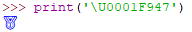

* 一个具体的简单实例如下：

```python
from qg_botsdk import BOT, Model, EmojiString

def deliver(data: Model.MESSAGE):
    if '你好' in data.treated_msg:
        data.reply("你好，世界 <emoji:106>")  # 发送QQ系统表情emoji（106:委屈）
        data.reply(f"你好，世界{EmojiString.委屈}")  # 如上，发送QQ系统表情emoji（106:委屈）-> EmojiString.委屈 = <emoji:106>
        data.reply("你好，世界 \U0001F600")  # 发送unicode格式的emoji

if __name__ == '__main__':
    bot = BOT(bot_id='xxx', bot_token='xxx', is_private=True)
    bot.bind_msg(deliver)
    bot.start()

```

## 表情表态API

### 发表表情表态

* 对`message_id`指定的消息进行表情表态

```python
bot.api.create_reaction()
# v2.2.0前路径：qg_botsdk.qg_bot.BOT().create_reaction()
# v2.2.0后路径：qg_botsdk.qg_bot.BOT().api.create_reaction()
```

| 参数         |        |        |        |
| ---------- | ------ | ------ | ------ |
| 字段名        | 类型     | 默认值    | 说明     |
| channel_id | string | 无，必选参数 | 子频道id  |
| message_id | string | 无，必选参数 | 目标消息id |
| type\_     | string | 无，必选参数 | 表情类型   |
| id\_       | string | 无，必选参数 | 表情id   |

> 表情类型可参考上述表情API中的表情对象（<https://bot.q.qq.com/wiki/develop/api/openapi/emoji/model.html>）

| 返回       |             |                             |
| -------- | ----------- | --------------------------- |
| 字段       | 类型          | 说明                          |
| data     | object None | 成功时data为None，失败并有code时是错误数据 |
| trace_id | string      | 腾讯官方提供的错误追踪 ID              |
| result   | bool        | 成功为True；否则为False            |

> 可通过 `result` 判断是否成功

### 删除表情表态

* 删除自己对`message_id`指定消息的表情表态

```python
bot.api.delete_reaction()
# v2.2.0前路径：qg_botsdk.qg_bot.BOT().delete_reaction()
# v2.2.0后路径：qg_botsdk.qg_bot.BOT().api.delete_reaction()
```

| 参数         |        |        |        |
| ---------- | ------ | ------ | ------ |
| 字段名        | 类型     | 默认值    | 说明     |
| channel_id | string | 无，必选参数 | 子频道id  |
| message_id | string | 无，必选参数 | 目标消息id |
| type\_     | string | 无，必选参数 | 表情类型   |
| id\_       | string | 无，必选参数 | 表情id   |

> 表情类型可参考上述表情API中的表情对象（<https://bot.q.qq.com/wiki/develop/api/openapi/emoji/model.html>）

| 返回       |             |                             |
| -------- | ----------- | --------------------------- |
| 字段       | 类型          | 说明                          |
| data     | object None | 成功时data为None，失败并有code时是错误数据 |
| trace_id | string      | 腾讯官方提供的错误追踪 ID              |
| result   | bool        | 成功为True；否则为False            |

> 可通过 `result` 判断是否成功

### 拉取表情表态用户列表

* 拉取对消息 `message_id` 指定表情表态的用户列表

* 已解决分页获取问题，将直接获取全部数据

```python
bot.api.get_reaction_users()
# v2.2.0前路径：qg_botsdk.qg_bot.BOT().get_reaction_users()
# v2.2.0后路径：qg_botsdk.qg_bot.BOT().api.get_reaction_users()
```

| 参数         |        |        |        |
| ---------- | ------ | ------ | ------ |
| 字段名        | 类型     | 默认值    | 说明     |
| channel_id | string | 无，必选参数 | 子频道id  |
| message_id | string | 无，必选参数 | 目标消息id |
| type\_     | string | 无，必选参数 | 表情类型   |
| id\_       | string | 无，必选参数 | 表情id   |

| 返回       |              |                             |
| -------- | ------------ | --------------------------- |
| 字段       | 类型           | 说明                          |
| data     | list[object] | 解析后的json数据列表                |
| trace_id | list[string] | 腾讯官方提供的错误追踪 ID ，每次请求整合的列表   |
| result   | list[bool]   | 成功为True；否则为False ，每次请求整合的列表 |

## 音频API

### 音频控制

* 用于控制子频道 `channel_id` 下的音频。

* 音频接口：仅限**音频类机器人**才能使用，后续会根据机器人类型自动开通接口权限，现如需调用，需联系平台申请权限

```python
bot.api.control_audio()
# v2.2.0前路径：qg_botsdk.qg_bot.BOT().control_audio()
# v2.2.0后路径：qg_botsdk.qg_bot.BOT().api.control_audio()
```

| 参数         |             |        |                                    |
| ---------- | ----------- | ------ | ---------------------------------- |
| 字段名        | 类型          | 默认值    | 说明                                 |
| channel_id | string      | 无，必选参数 | 子频道id                              |
| status     | int         | 无，必选参数 | 播放状态                               |
| audio_url  | string None | None   | 音频数据的url，status为0时传                |
| text       | string None | None   | 状态文本（比如：简单爱-周杰伦），status为0时传，其他操作不传 |

| 返回       |             |                             |
| -------- | ----------- | --------------------------- |
| 字段       | 类型          | 说明                          |
| data     | object None | 成功时data为None，失败并有code时是错误数据 |
| trace_id | string      | 腾讯官方提供的错误追踪 ID              |
| result   | bool        | 成功为True；否则为False            |

> 可通过 `result` 判断是否成功

### 机器人上麦

* 机器人在 `channel_id` 对应的语音子频道上麦

* 音频接口：仅限**音频类机器人**才能使用，后续会根据机器人类型自动开通接口权限，现如需调用，需联系平台申请权限

```python
bot.api.bot_on_mic()
# v2.2.0前路径：qg_botsdk.qg_bot.BOT().bot_on_mic()
# v2.2.0后路径：qg_botsdk.qg_bot.BOT().api.bot_on_mic()
```

| 参数         |        |        |       |
| ---------- | ------ | ------ | ----- |
| 字段名        | 类型     | 默认值    | 说明    |
| channel_id | string | 无，必选参数 | 子频道id |

| 返回       |             |                             |
| -------- | ----------- | --------------------------- |
| 字段       | 类型          | 说明                          |
| data     | object None | 成功时data为None，失败并有code时是错误数据 |
| trace_id | string      | 腾讯官方提供的错误追踪 ID              |
| result   | bool        | 成功为True；否则为False            |

> 可通过 `result` 判断是否成功

### 机器人下麦

* 机器人在 `channel_id` 对应的语音子频道下麦

* 音频接口：仅限**音频类机器人**才能使用，后续会根据机器人类型自动开通接口权限，现如需调用，需联系平台申请权限

```python
bot.api.bot_off_mic()
# v2.2.0前路径：qg_botsdk.qg_bot.BOT().bot_off_mic()
# v2.2.0后路径：qg_botsdk.qg_bot.BOT().api.bot_off_mic()
```

| 参数         |        |        |       |
| ---------- | ------ | ------ | ----- |
| 字段名        | 类型     | 默认值    | 说明    |
| channel_id | string | 无，必选参数 | 子频道id |

| 返回       |             |                             |
| -------- | ----------- | --------------------------- |
| 字段       | 类型          | 说明                          |
| data     | object None | 成功时data为None，失败并有code时是错误数据 |
| trace_id | string      | 腾讯官方提供的错误追踪 ID              |
| result   | bool        | 成功为True；否则为False            |

> 可通过 `result` 判断是否成功

## 帖子API

### 获取帖子列表

* 获取子频道下的帖子列表

* 已解决分页获取问题，将直接获取全部数据


```python
bot.api.get_threads()
# v2.2.0前路径：qg_botsdk.qg_bot.BOT().get_threads()
# v2.2.0后路径：qg_botsdk.qg_bot.BOT().api.get_threads()
```

| 参数         |        |        |           |
| ---------- | ------ | ------ | --------- |
| 字段名        | 类型     | 默认值    | 说明        |
| channel_id | string | 无，必选参数 | 目标论坛子频道id |

| 返回       |              |                             |
| -------- | ------------ | --------------------------- |
| 字段       | 类型           | 说明                          |
| data     | list[object] | 解析后的json数据列表                |
| trace_id | list[string] | 腾讯官方提供的错误追踪 ID ，每次请求整合的列表   |
| result   | list[bool]   | 成功为True；否则为False ，每次请求整合的列表 |

> data当中每一项数据中，thread_info的结构大致如下：

```text
thread_info
├── thread_id（str）
├── date_time（str）
├── title（str）
├── content（object）
|   ├── paragraphs（list）
|   |   ├── elems（list）
|   |   |   ├── type（int）
|   |   |   ├── 根据type字段判断此字段，目前可能的值：text、url、image、video
|   |   ├── props
```

> 现有推送和相关信息的type字段：

> type 1：普通文本，子字段text

> type 2：图片，子字段image

> type 3：视频，子字段video

>

> type 4：url信息，子字段url

### 获取帖子详情

* 获取子频道下的帖子详情


```python
bot.api.get_thread_info()
# v2.2.0前路径：qg_botsdk.qg_bot.BOT().get_thread_info()
# v2.2.0后路径：qg_botsdk.qg_bot.BOT().api.get_thread_info()
```

| 参数         |        |        |           |
| ---------- | ------ | ------ | --------- |
| 字段名        | 类型     | 默认值    | 说明        |
| channel_id | string | 无，必选参数 | 目标论坛子频道id |
| thread_id  | string | 无，必选参数 | 帖子id      |

| 返回       |        |                  |
| -------- | ------ | ---------------- |
| 字段       | 类型     | 说明               |
| data     | object | 解析后的json数据       |
| trace_id | string | 腾讯官方提供的错误追踪 ID   |
| result   | bool   | 成功为True；否则为False |

> data当中每一项数据中，thread_info的结构大致如下：

```text
thread_info
├── thread_id（str）
├── date_time（str）
├── title（str）
├── content（object）
|   ├── paragraphs（list）
|   |   ├── elems（list）
|   |   |   ├── type（int）
|   |   |   ├── 根据type字段判断此字段，目前可能的值：text、url、image、video
|   |   ├── props
```

> 现有推送和相关信息的type字段：

> type 1：普通文本，子字段text

> type 2：图片，子字段image

> type 3：视频，子字段video

>

> type 4：url信息，子字段url

### 发表帖子

* 创建帖子，创建成功后，返回创建成功的任务ID


```python
bot.api.create_thread()
# v2.2.0前路径：qg_botsdk.qg_bot.BOT().create_thread()
# v2.2.0后路径：qg_botsdk.qg_bot.BOT().api.create_thread()
```

| 参数         |        |        |                                         |
| ---------- | ------ | ------ | --------------------------------------- |
| 字段名        | 类型     | 默认值    | 说明                                      |
| channel_id | string | 无，必选参数 | 目标论坛子频道id                               |
| title      | string | 无，必选参数 | 帖子标题                                    |
| content    | string | 无，必选参数 | 帖子内容（具体格式根据format\_判断）                  |
| format\_   | string | 无，必选参数 | 帖子文本格式（1：普通文本、2：HTML、3：Markdown、4：Json） |

> HTML例子：

> content = `'<html lang=\"en-US\"><body><a href=\"https://bot.q.qq.com/wiki\" title=\"QQ机器人文档Title\">QQ机器人文档</a>\n<ul><li>主动消息：发送消息时，未填msg_id字段的消息。</li><li>被动消息：发送消息时，填充了msg_id字段的消息。</li></ul></body></html>'`

>

> JSON例子（最新json格式可参阅官方文档：<https://bot.q.qq.com/wiki/develop/api/openapi/forum/model.html>）：

> content = `'{"paragraphs": [{"elems": [{"text": {"text": "第一句内容"}, "type": 1}], "props": {"alignment": 1}}, {"elems": [{"text": {"text": "第二句内容"}, "type": 1}], "props": {}}, {"elems": [{"url": {"url": "https://www.google.com", "desc": "这是链接内容"}, "type": 4}], "props": {}}, {"elems": [{"text": {"text": "第三句内容"}, "type": 1}], "props": {}}, {"elems": [{"text": {"text": "第四句内容"}, "type": 1}], "props": {}}, {"elems": [{"text": {"text": "第五句内容"}, "type": 1}], "props": {}}, {"elems": [{"text": {"text": "第六句内容"}, "type": 1}], "props": {}}]}'`

| 返回       |        |                  |
| -------- | ------ | ---------------- |
| 字段       | 类型     | 说明               |
| data     | object | 解析后的json数据       |
| trace_id | string | 腾讯官方提供的错误追踪 ID   |
| result   | bool   | 成功为True；否则为False |

### 删除帖子

* 删除指定子频道下的某个帖子


```python
bot.api.delete_thread()
# v2.2.0前路径：qg_botsdk.qg_bot.BOT().delete_thread()
# v2.2.0后路径：qg_botsdk.qg_bot.BOT().api.delete_thread()
```

| 参数         |        |        |           |
| ---------- | ------ | ------ | --------- |
| 字段名        | 类型     | 默认值    | 说明        |
| channel_id | string | 无，必选参数 | 目标论坛子频道id |
| thread_id  | string | 无，必选参数 | 帖子id      |

| 返回       |             |                             |
| -------- | ----------- | --------------------------- |
| 字段       | 类型          | 说明                          |
| data     | object None | 成功时data为None，失败并有code时是错误数据 |
| trace_id | string      | 腾讯官方提供的错误追踪 ID              |
| result   | bool        | 成功为True；否则为False            |

> 可通过 `result` 判断是否成功

## 机器人接口权限 API

### 获取频道可用权限列表

* 获取机器人在频道 `guild_id` 内可以使用的权限列表

```python
bot.api.get_guild_permissions()
# v2.2.0前路径：qg_botsdk.qg_bot.BOT().get_guild_permissions()
# v2.2.0后路径：qg_botsdk.qg_bot.BOT().api.get_guild_permissions()
```

| 参数       |        |        |      |
| -------- | ------ | ------ | ---- |
| 字段名      | 类型     | 默认值    | 说明   |
| guild_id | string | 无，必选参数 | 频道ID |

| 返回       |        |                  |
| -------- | ------ | ---------------- |
| 字段       | 类型     | 说明               |
| data     | object | 解析后的json数据       |
| trace_id | string | 腾讯官方提供的错误追踪 ID   |
| result   | bool   | 成功为True；否则为False |

> `data` 中 `apis` 字段（列表list）中每一项的数据：

| 字段名         | 类型     | 说明                                                 |
| ----------- | ------ | -------------------------------------------------- |
| api         | string | 该 API 在 SDK 中的名字，如get_guild_info（需求sdk版本v2.2.1或以上） |
| path        | string | API 接口名，例如/guilds/{guild_id}/members/{user_id}     |
| method      | string | 请求方法，例如GET                                         |
| desc        | string | API 接口名称，例如 获取频道信息                                 |
| auth_status | int    | 授权状态，auth_stats 为 1 时已授权                           |

### 创建频道 API 接口权限授权链接

* 用于创建 API 接口权限授权链接，该链接指向`guild_id`对应的频道

* 每天只能在一个频道内发 `3` 条（默认值）频道权限授权链接

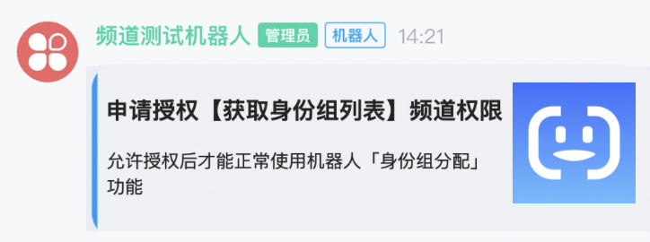

```python
bot.api.create_permission_demand()
# v2.2.0前路径：qg_botsdk.qg_bot.BOT().create_permission_demand()
# v2.2.0后路径：qg_botsdk.qg_bot.BOT().api.create_permission_demand()
```

| 参数         |        |        |                           |
| ---------- | ------ | ------ | ------------------------- |
| 字段名        | 类型     | 默认值    | 说明                        |
| guild_id   | string | 无，必选参数 | 频道ID                      |
| channel_id | string | 无，必选参数 | 子频道ID                     |
| api        | string | 无，必选参数 | 需求权限的API在sdk的名字           |
| desc       | string | 无，必选参数 | 机器人申请对应的API接口权限后可以使用功能的描述 |
