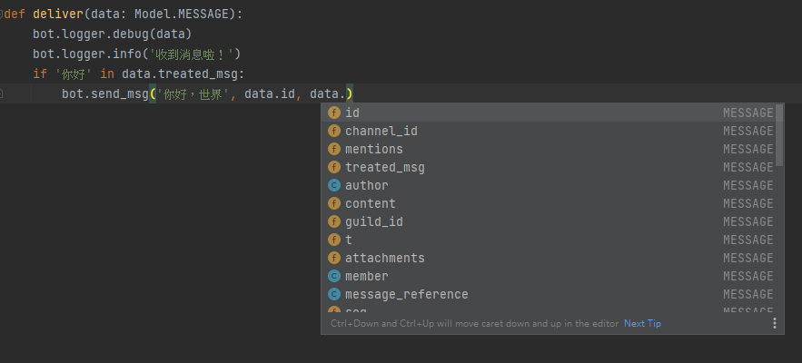
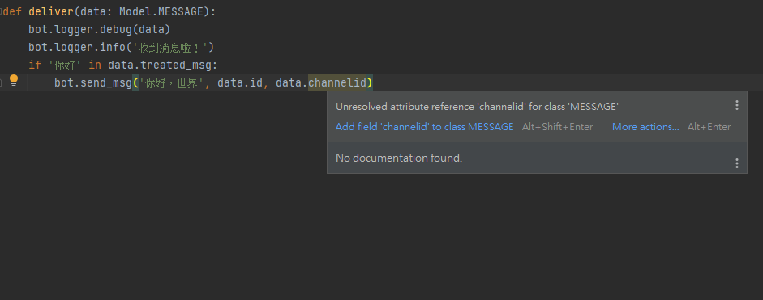
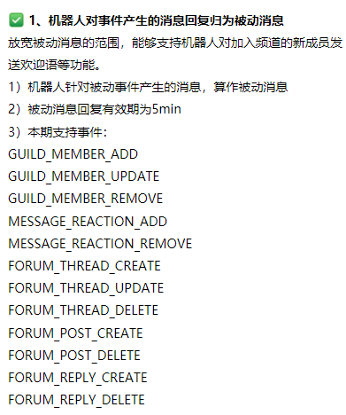
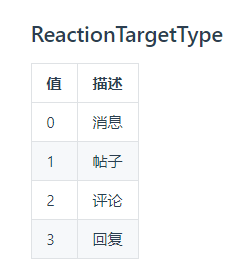

# Model库

qg_botsdk提供了数据的模型数据供大家验证结构准确性，更轻易避免出现bug而无法运行机器人的情况。本文将带领大家粗略认识一下model库的应用和相关的数据结构

## 使用

```python
from qg_botsdk import Model   ## 导入数据模型
```

导入后，即可透过类型提示（data: MESSAGE）的方法验证数据结构正确性：

```python
def deliver(data: Model.MESSAGE):  ## Model.MESSAGE为导入的一个数据模型
    if '你好' in data.treated_msg:
        bot.send_msg('你好，世界', data.id, data.channel_id)
```

当使用数据子项时，你使用的IDE理论上将会有相应的子数据结构提示：



而当输入错误的数据结构（正确的字段名为`channel_id`，而非`channelid`）时，你使用的IDE理论上将会提示错误：



需要注意的是，所有事件都会返回一个`event_id`的值，但只有以下事件的event_id可以用作发送被动消息的消息ID：



## 数据结构

### GUILDS

| 结构           |        |                                            |
| ------------ | ------ | ------------------------------------------ |
| 字段名          | 类型     | 说明                                         |
| description  | sring  | 频道介绍                                       |
| icon         | sring  | 频道头像图片url                                  |
| id           | sring  | 频道ID（guild id）                             |
| joined_at    | sring  | 机器人加入频道时间，具体格式例如：2021-10-21T11:20:18+08:00 |
| max_members  | int    | 频道最大成员数                                    |
| member_count | int    | 频道当前成员数                                    |
| name         | string | 频道名                                        |
| op_user_id   | string | 操作人ID                                      |
| owner_id     | string | 频道拥有者ID                                    |
| t            | string | 事件类型字段，如GUILD_CREATE                       |
| event_id     | sring  | 事件ID                                       |

### CHANNELS（需求sdk版本≥v2.2.4）

| 结构               |        |                                           |
| ---------------- | ------ | ----------------------------------------- |
| 字段名              | 类型     | 说明                                        |
| application_id   | sring  | 标识应用子频道应用类型                               |
| guild_id         | sring  | 频道ID                                      |
| id               | sring  | 子频道ID（channel id）                         |
| name             | sring  | 子频道名                                      |
| op_user_id       | string | 操作人ID                                     |
| owner_id         | string | 频道拥有者ID                                   |
| parent_id        | string | 所属分组 id，仅对子频道有效，对 子频道分组（ChannelType=4） 无效 |
| permissions      | string | 用户拥有的子频道权限                                |
| position         | int    | 排序值                                       |
| private_type     | int    | 子频道私密类型                                   |
| speak_permission | int    | 子频道发言权限                                   |
| sub_type         | int    | 子频道子类型                                    |
| type             | int    | 子频道类型                                     |
| t                | string | 事件类型字段，如GUILD_CREATE                      |
| event_id         | sring  | 事件ID                                      |

### GUILD_MEMBERS

| 结构         |        |                                            |
| ---------- | ------ | ------------------------------------------ |
| 字段名        | 类型     | 说明                                         |
| guild_id   | sring  | 频道ID                                       |
| joined_at  | sring  | 该成员加入频道时间，具体格式例如：2021-10-21T11:20:18+08:00 |
| nick       | string | 成员在当前频道的昵称                                 |
| roles      | list   | 该成员拥有的身份组ID列表，当中每个身份组ID的类型为string          |
| user       | object | 该成员详细信息，其子类请参阅下表【结构：user】                  |
| op_user_id | string | 操作人ID                                      |
| t          | string | 事件类型字段，如GUILD_CREATE                       |
| event_id   | sring  | 事件ID                                       |

| 结构：user  |        |             |
| -------- | ------ | ----------- |
| 字段名      | 类型     | 说明          |
| avatar   | sring  | 该成员头像图片url  |
| bot      | bool   | 该成员是否机器人    |
| id       | string | 该成员的ID      |
| username | list   | 该成员在频道全局的昵称 |

### MESSAGE

| 结构                |        |                                                         |
| ----------------- | ------ | ------------------------------------------------------- |
| 字段名               | 类型     | 说明                                                      |
| author            | object | 发送消息成员的详细信息，其子类请参阅下表【结构：author】                         |
| channel_id        | sring  | 子频道ID                                                   |
| guild_id          | sting  | 频道ID                                                    |
| content           | string | 消息内容                                                    |
| message_reference | object | 该条消息的引用消息数据，如没有引用则没有此字段，其子类请参阅下表【结构：message_reference】  |
| mentions          | object | 该条消息@其他成员的数据，如没有艾特则没有此字段，列表中的子类请参阅下表【结构：Mentions】       |
| attachments       | object | 该条消息的附件（图片）数据，如没有附件则没有此字段，列表中的子类请参阅下表【结构：Attachments】   |
| id                | string | 消息ID（用于发送被动消息）                                          |
| seq               | int    | 用于消息间的排序，seq 在同一子频道中按从先到后的顺序递增，不同的子频道之间消息无法排序           |
| seq_in_channel    | string | 子频道消息 seq，用于消息间的排序，seq 在同一子频道中按从先到后的顺序递增，不同的子频道之间消息无法排序 |
| timestamp         | string | 消息创建时间（ISO8601 timestamp）                               |
| tts               | bool   | 未知详情，疑似text-to-speech语音合成（该字段不稳定出现，请勿用于运营应用环境）          |
| pinned            | bool   | 该消息是否精华消息（该字段不稳定出现，请勿用于运营应用环境）                          |
| type              | sring  | 未知详情，疑似消息类型（该字段不稳定出现，请勿用于运营应用环境）                        |
| flags             | sring  | 未知详情（该字段不稳定出现，请勿用于运营应用环境）                               |
| t                 | string | 事件类型字段，如GUILD_CREATE                                    |
| event_id          | sring  | 事件ID                                                    |
| treated_msg       | string | 经过处理（包括去除艾特机器人、/等字段）的内容（绑定事件时treated_data=False则没有此字段）  |

| 结构：author |        |             |
| --------- | ------ | ----------- |
| 字段名       | 类型     | 说明          |
| avatar    | sring  | 该成员头像图片url  |
| bot       | bool   | 该成员是否机器人    |
| id        | string | 该成员的ID      |
| username  | list   | 该成员在频道全局的昵称 |

| 结构：message_reference |       |            |
| -------------------- | ----- | ---------- |
| 字段名                  | 类型    | 说明         |
| message_id           | sring | 被引用消息的消息ID |

| 结构：Mentions |        |              |
| ----------- | ------ | ------------ |
| 字段名         | 类型     | 说明           |
| avatar      | sring  | 被@成员头像图片url  |
| bot         | bool   | 被@成员是否机器人    |
| id          | string | 被@成员的ID      |
| username    | list   | 被@成员在频道全局的昵称 |

| 结构：Attachments |        |                            |
| -------------- | ------ | -------------------------- |
| 字段名            | 类型     | 说明                         |
| content_type   | sring  | 附件类型，如：image/jpeg          |
| filename       | string | 附件名，如：504BA0……6A509E68.jpg |
| height         | int    | 高度                         |
| width          | int    | 宽度                         |
| size           | int    | 附件大小                       |
| id             | string | 附件ID                       |
| url            | string | 附件url                      |

### DIRECT_MESSAGE

| 结构                |        |                                                         |
| ----------------- | ------ | ------------------------------------------------------- |
| 字段名               | 类型     | 说明                                                      |
| author            | object | 发送消息成员的详细信息，其子类请参阅下表【结构：author】                         |
| channel_id        | sring  | 子频道ID                                                   |
| guild_id          | sting  | 频道ID                                                    |
| content           | string | 消息内容                                                    |
| message_reference | object | 该条消息的引用消息数据，如没有引用则没有此字段，其子类请参阅下表【结构：message_reference】  |
| attachments       | object | 该条消息的附件（图片）数据，如没有附件则没有此字段，列表中的子类请参阅下表【结构：Attachments】   |
| id                | string | 消息ID（用于发送被动消息）                                          |
| seq               | int    | 用于消息间的排序，seq 在同一子频道中按从先到后的顺序递增，不同的子频道之间消息无法排序           |
| seq_in_channel    | string | 子频道消息 seq，用于消息间的排序，seq 在同一子频道中按从先到后的顺序递增，不同的子频道之间消息无法排序 |
| src_guild_id      | string | 用于私信场景下识别真实的来源频道id                                      |
| timestamp         | string | 消息创建时间（ISO8601 timestamp）                               |
| t                 | string | 事件类型字段，如GUILD_CREATE                                    |
| event_id          | sring  | 事件ID                                                    |
| treated_msg       | string | 经过处理（包括去除艾特机器人、/等字段）的内容（绑定事件时treated_data=False则没有此字段）  |

| 结构：author |        |             |
| --------- | ------ | ----------- |
| 字段名       | 类型     | 说明          |
| avatar    | sring  | 该成员头像图片url  |
| bot       | bool   | 该成员是否机器人    |
| id        | string | 该成员的ID      |
| username  | list   | 该成员在频道全局的昵称 |

| 结构：message_reference |       |            |
| -------------------- | ----- | ---------- |
| 字段名                  | 类型    | 说明         |
| message_id           | sring | 被引用消息的消息ID |

| 结构：Attachments |        |                            |
| -------------- | ------ | -------------------------- |
| 字段名            | 类型     | 说明                         |
| content_type   | sring  | 附件类型，如：image/jpeg          |
| filename       | string | 附件名，如：504BA0……6A509E68.jpg |
| height         | int    | 高度                         |
| width          | int    | 宽度                         |
| size           | int    | 附件大小                       |
| id             | string | 附件ID                       |
| url            | string | 附件url                      |

### MESSAGE_DELETE

| 结构       |        |                                 |
| -------- | ------ | ------------------------------- |
| 字段名      | 类型     | 说明                              |
| message  | object | 被撤回消息的消息数据，其子类请参阅下表【结构：message】 |
| op_user  | object | 操作人数据，其子类只有id（类型为string）        |
| t        | string | 事件类型字段，如GUILD_CREATE            |
| event_id | sring  | 事件ID                            |

| 结构：message |        |                                |
| ---------- | ------ | ------------------------------ |
| 字段名        | 类型     | 说明                             |
| author     | object | 被撤回消息的作者数据，其子类请参阅下表【结构：author】 |
| id         | string | 被撤回消息的消息ID                     |
| channel_id | string | 子频道ID                          |
| guild_id   | string | 频道ID                           |

| 结构：author |        |          |
| --------- | ------ | -------- |
| 字段名       | 类型     | 说明       |
| bot       | bool   | 该成员是否机器人 |
| id        | string | 该成员ID    |
| username  | string | 该成员昵称    |

### MESSAGE_AUDIT

| 结构          |        |                                   |
| ----------- | ------ | --------------------------------- |
| 字段名         | 类型     | 说明                                |
| audit_id    | string | 消息审核ID                            |
| audit_time  | string | 消息审核时间（ISO8601 timestamp）         |
| create_time | string | 消息创建时间（ISO8601 timestamp）         |
| channel_id  | string | 子频道ID                             |
| guild_id    | string | 频道ID                              |
| message_id  | string | 成功后的消息ID（只有审核通过事件才会有message_id的值） |
| t           | string | 事件类型字段，如GUILD_CREATE              |
| event_id    | sring  | 事件ID                              |

### FORUMS_EVENT

-   官方目前仍在开发此事件，目前的字段存在许多冗余，因此后续很有可能随时出现变化。

-   如遇到官方更改字段的相关情况，请马上 [联系作者](/联系与反馈) 进行修改，后下载最新release使用>

-   `thread_info`字段较为复杂，具体可视化结构如下：

```text
thread_info
├── title
|   ├── paragraphs (list)
|   |   ├── elems (list)
|   |   |   ├── type
|   |   |   ├── text
|   |   |   |   ├── text
|   |   ├── props
├── content
|   ├── paragraphs (list)
|   |   ├── elems (list)
|   |   |   ├── type
|   |   |   ├── 根据type字段判断此字段，目前可能的值：text、url、(image、video)
|   |   ├── props
```

| 结构          |        |                                 |
| ----------- | ------ | ------------------------------- |
| 字段名         | 类型     | 说明                              |
| thread_info | object | 帖子数据详情，其子类请参阅下表【结构：thread_info】 |
| author_id   | string | 帖子作者的频道ID                       |
| date_time   | string | 帖子发布事件（ISO8601 timestamp）       |
| channel_id  | string | 子频道ID                           |
| guild_id    | string | 频道ID                            |
| thread_id   | string | 帖子ID                            |
| t           | string | 事件类型字段，如GUILD_CREATE            |
| event_id    | sring  | 事件ID                            |

| 结构：thread_info |        |                         |
| -------------- | ------ | ----------------------- |
| 字段名            | 类型     | 说明                      |
| title          | object | 标题数据，其子类请参阅【结构：sub_thr】 |
| content        | object | 标题数据，其子类请参阅【结构：sub_thr】 |

| 结构：sub_thr |      |                       |
| ---------- | ---- | --------------------- |
| 字段名        | 类型   | 说明                    |
| paragraphs | list | 段落列表，其每一项请参阅【结构：para】 |

| 结构：para |        |                                                        |
| ------- | ------ | ------------------------------------------------------ |
| 字段名     | 类型     | 说明                                                     |
| elems   | list   | 内容元素，其每一项请分别参阅——title：【结构：elems_t】content：【结构：elems_c】 |
| props   | object | 作用未名，空object数据                                         |

| 结构：elems_t |        |                       |
| ---------- | ------ | --------------------- |
| 字段名        | 类型     | 说明                    |
| text       | object | 包含一个子类text，其类型为string |
| type       | int    | 元素类型，可能的值：1（普通文本）     |

| 结构：elems_c |        |                                      |
| ---------- | ------ | ------------------------------------ |
| 字段名        | 类型     | 说明                                   |
| text       | object | 包含一个子类text，其类型为string                |
| url        | object | 包含两个子类：url desc，其类型均为string          |
| type       | int    | 元素类型，可能的值：1（普通文本）、2（图片）、3（视频）、4（url） |

> 现有推送和相关信息的type字段：

> type 1：普通文本，子字段text

> type 2：图片，子字段image（曾短暂出现，目前为空子字段，无任何内容反馈）

> type 3：视频，子字段video（曾短暂出现，目前为空子字段，无任何内容反馈）

>

> type 4：url信息，子字段url

>

>

>

> 现无推送，根据文档列出的type：

> 原type 2：at信息，目前为空子字段，无任何内容反馈

> 原type 4：表情，目前为空子字段，无任何内容反馈

> 原type 5：##子频道，目前为空子字段，无任何内容反馈

### OPEN_FORUMS

-   公域版本的FORUMS论坛事件

| 结构         |        |                      |
| ---------- | ------ | -------------------- |
| 字段名        | 类型     | 说明                   |
| channel_id | string | 子频道ID                |
| guild_id   | string | 频道ID                 |
| author_id  | string | 帖子作者的频道ID            |
| t          | string | 事件类型字段，如GUILD_CREATE |
| event_id   | sring  | 事件ID                 |

### AUDIO_ACTION

-   只有AUDIO_START、AUDIO_FINISH拥有audio_url和text字段

| 结构         |        |                      |
| ---------- | ------ | -------------------- |
| 字段名        | 类型     | 说明                   |
| audio_url  | string | 音频url                |
| text       | string | 音频描述                 |
| channel_id | string | 子频道ID                |
| guild_id   | string | 频道ID                 |
| t          | string | 事件类型字段，如GUILD_CREATE |
| event_id   | sring  | 事件ID                 |

### REACTION

| 结构         |        |                                 |
| ---------- | ------ | ------------------------------- |
| 字段名        | 类型     | 说明                              |
| emoji      | object | 表情表态的emoji数据，其子类请参阅下表【结构：emoji】 |
| target     | object | 表态引用对象的数据，其子类请参阅下表【结构：target】   |
| user_id    | string | 发布表情表态的用户ID                     |
| channel_id | string | 子频道ID                           |
| guild_id   | string | 频道ID                            |
| t          | string | 事件类型字段，如GUILD_CREATE            |
| event_id   | sring  | 事件ID                            |

| 结构：emoji |        |      |
| -------- | ------ | ---- |
| 字段名      | 类型     | 说明   |
| id       | string | 表情ID |
| type     | int    | 表情类型 |

> 表情ID和类型可参阅：<https://bot.q.qq.com/wiki/develop/api/openapi/emoji/model.html>

| 结构：target |        |               |
| --------- | ------ | ------------- |
| 字段名       | 类型     | 说明            |
| id        | string | 表态对象的ID       |
| type      | int    | 表态对象的类型（参考下图） |

表态对象类型如下：



### INTERACTION

| 结构             |        |                             |
| -------------- | ------ | --------------------------- |
| 字段名            | 类型     | 说明                          |
| data           | object | 互动事件的返回数据，其子类请参阅下表【结构：data】 |
| application_id | string | APP ID                      |
| channel_id     | string | 子频道ID                       |
| guild_id       | string | 频道ID                        |
| id             | string | 未知                          |
| type           | int    | 未知                          |
| version        | int    | 未知                          |
| t              | string | 事件类型字段，如GUILD_CREATE        |
| event_id       | sring  | 事件ID                        |

| 结构：data  |        |                                   |
| -------- | ------ | --------------------------------- |
| 字段名      | 类型     | 说明                                |
| resolved | object | 互动事件的解析返回数据，其子类请参阅下表【结构：resolved】 |
| type     | int    | 未知                                |

| 结构：resolved |        |             |
| ----------- | ------ | ----------- |
| 字段名         | 类型     | 说明          |
| button_data | string | 按钮配置的返回数据   |
| button_id   | string | 按钮配置的按钮ID   |
| message_id  | string | 触发按钮事件的消息ID |
| user_id     | string | 触发按钮事件的用户ID |

### LIVE_CHANNEL_MEMBER

| 结构           |        |                         |
| ------------ | ------ | ----------------------- |
| 字段名          | 类型     | 说明                      |
| channel_id   | string | 子频道ID                   |
| channel_type | string | 子频道类型（2-音视频子频道 5-直播子频道） |
| guild_id     | string | 频道ID                    |
| user_id      | string | 用户ID                    |
| t            | string | 事件类型字段，如GUILD_CREATE    |
| event_id     | sring  | 事件ID                    |
