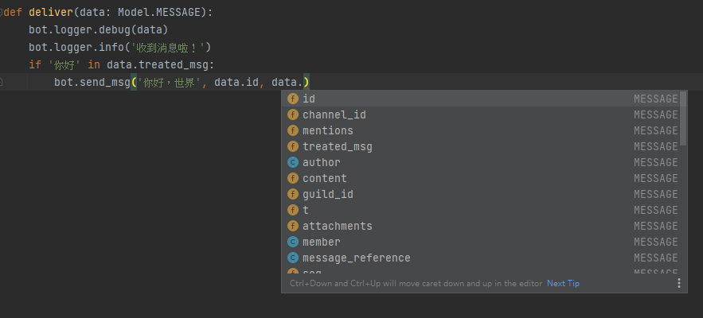

# 简介


这是qg_botsdk的帮助文档，Github库链接为：<https://github.com/GLGDLY/qg_botsdk>

## qg_botsdk 是什么？

qg_botsdk是一款轻量化、使用python进行编写的轻量应用级SDK，适用于制作QQ官方频道机器人，其定位为：专注于简洁、容易上手而且稳定的一款SDK。

点此前往注册QQ官方机器人：<https://q.qq.com/#/>

点此前往下载最新release：<https://github.com/GLGDLY/qg_botsdk/releases>

## 为什么选择 qg_botsdk ？

### 1. 灵活的数据构建方式

qg_botsdk最大的特色，是其灵活的数据返回结构。如果大家有留意，很多其他的SDK会规范了内部数据格式，在机器人平台后台新增或修改了返回数据的结构时，往往需要要求作者及时查阅并更新SDK版本，才能让使用SDK的开发者们获取到最新的数据内容。

而qg_botsdk虽然同样提供了数据的内容和类型提示，但它并没有用这些内容和类型提示去锁死返回给大家的数据，而它所做的是如实把事件数据和api接口返回的数据构建成object去返回。即使某一天官方在某个api上新增了一些数据字段，而作者可能还来不及或没意识到要进行更新，qg_botsdk也许在类型提示上会看不到该个最新的字段，但其返回的数据仍然会是包含着新增数据字段的最新数据内容。而你如何能得知最新的数据内容呢？qg_botsdk提供了简单的获取方式，只需要大家对数据使用print()或者str()，就能直接获取JSON化的返回数据结构，之后无视type hint进行获取即可，比如：

```python
gi = bot.api.get_guild_info('某频道的guild_id')
print(gi)
# 借由上面的指令，你可以获取到以下资料：
# {"data": {"id": "xxx", "name": "xxx", "icon": "xxx", "owner_id": "xxx", "owner": false, "joined_at": "xxx", "member_count": 11, "max_members": 1200, "description": "xxx"}, "trace_id": "xxx", "http_code": 200, "result": true}
# 其中data是返回的数据实体，trace_id是腾讯的内部bug追踪id，http_code是请求api时返回的状态码，result是sdk帮忙判断的api请求是否成功

# 那么如果腾讯新增了一个名为abc的字段，sdk会怎么处理呢？
# {"data": {"abc": "xxx", "id": "xxx", "name": "xxx", "icon": "xxx", "owner_id": "xxx", "owner": false, "joined_at": "xxx", "member_count": 11, "max_members": 1200, "description": "xxx"}, "trace_id": "xxx", "http_code": 200, "result": true}

# SDK会如实给你反馈abc这个字段；唯一的问题是，如果要获取数据的时候，你的ide可能会提示无相关字段
# 因此，你要做的是无视ide的提示，直接获取 gi.data.abc 即可
```

### 2. 简洁易上手的结构

qg_botsdk提供了非常简洁的组件格式和容易上手的交互式设计，仅需10行代码即可构建一个简单的程序：

```python
# qg_botsdk的一个简单工作流

from qg_botsdk import BOT, Model


def deliver(data: Model.MESSAGE):
    if '你好' in data.treated_msg:
        bot.api.send_msg(data.channel_id, '你好，世界', message_id=data.id)


if __name__ == '__main__':
    bot = BOT(bot_id='xxx', bot_token='xxx')
    bot.bind_msg(deliver, treated_data=True)
    bot.start()
```

除了简洁外，借助SDK内部的model库（`from qg_botsdk.model import Model`），在为数据添加model内的类型（`data: Model.MESSAGE`）后，即可以使用python内交互方式获取数据内的结构化子节，无需花费时间记忆和翻译官方Json字段，如下：



### 3. 无需学会asyncio也可使用

SDK很多时候都会要求使用asyncio编写接收事件的函数，但是否真的有这个必要？诚言，使用asyncio可以更有效优化程序性能，可以占用更少的内存来完成任务。但对于QQ频道机器人这个应用场景而言，是否有必要使用asyncio去优化性能呢？

答案是：没有必要。

异步编写的SDK除了同时强制用户必须同样使用asyncio编写，对新手较为不友好外；在当今技术发展迅速、电脑性能不断上升的情况下，小型程序对于运行性能其实并不需要有过多的追求；而在机器人普遍应用场景下，就算是完全没有异步的单线程运行，其实都已经可以完美应付当前的需求。

基于以上观点，qg_botsdk分割出了有必要使用asyncio的部分，将其完全内嵌到SDK内部。而在剩下的部分中，sdk在对外封装了async和threading抽象化应用层模式，允许你根据自己的需要，选择合适的模式去开发你的机器人。

### 4. 稳定的结构、统一的字段

对于我来说，我最烦的就是机器人跑着跑着动不动就抛异常崩溃，要我手动重开之余更影响机器人本身的运营稳定性。由此，qg_botsdk也继承了这个观念，只要不影响机器人运行，它便不会随便报错，只会在比如输入id和token错误之类的时候进行报错，保障机器人日常运行的稳定性。

同时，官方提供的API当中其实有很多割裂的位置、不统一字段。这里的例子比如官方发送消息的API中，发送消息的字段名叫`msg_id`，而引用消息的消息id字段名叫`messsage_id`；又比如以下的字段例子：


qg_botsdk则为大家统一地解决了这些问题，基本一致化了所有字段的名称，方便大家使用。

## 开始使用？

**{ref}`马上开始！ <快速入门>`**
